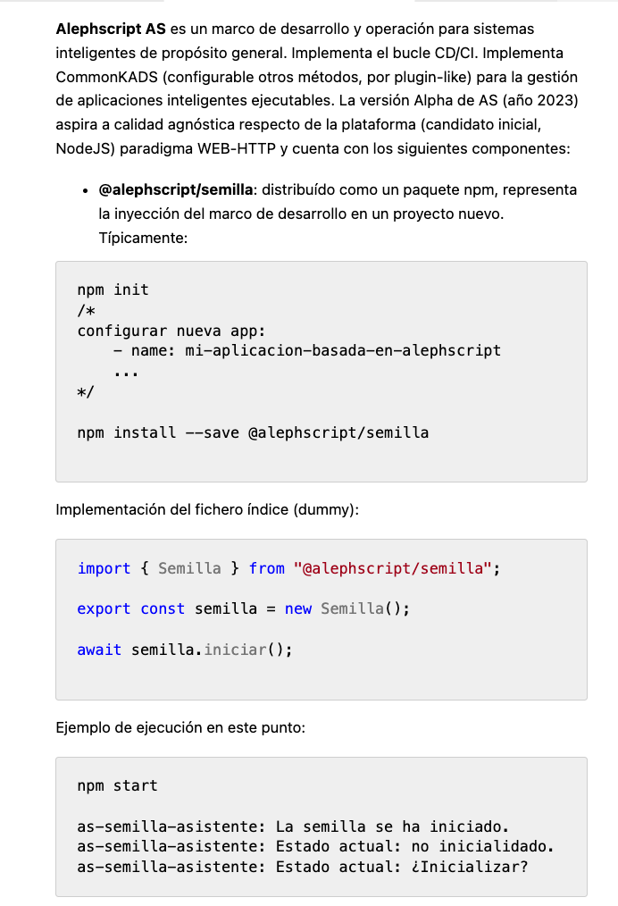
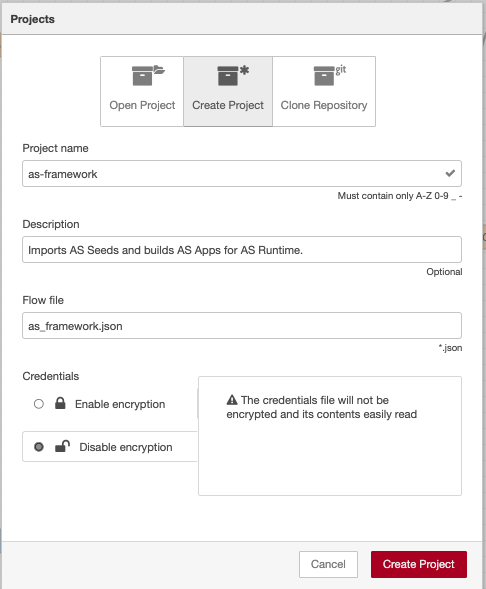
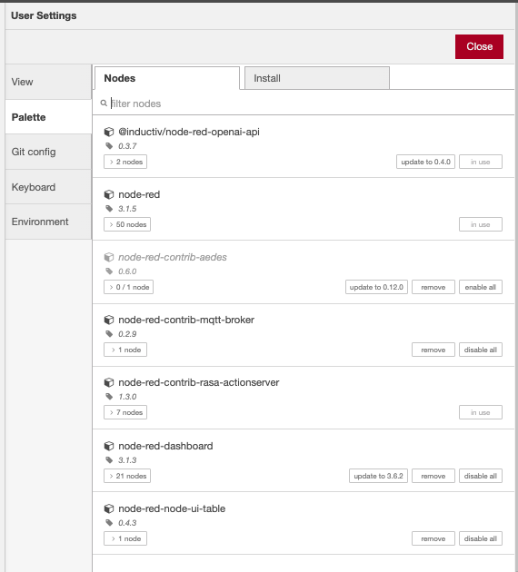
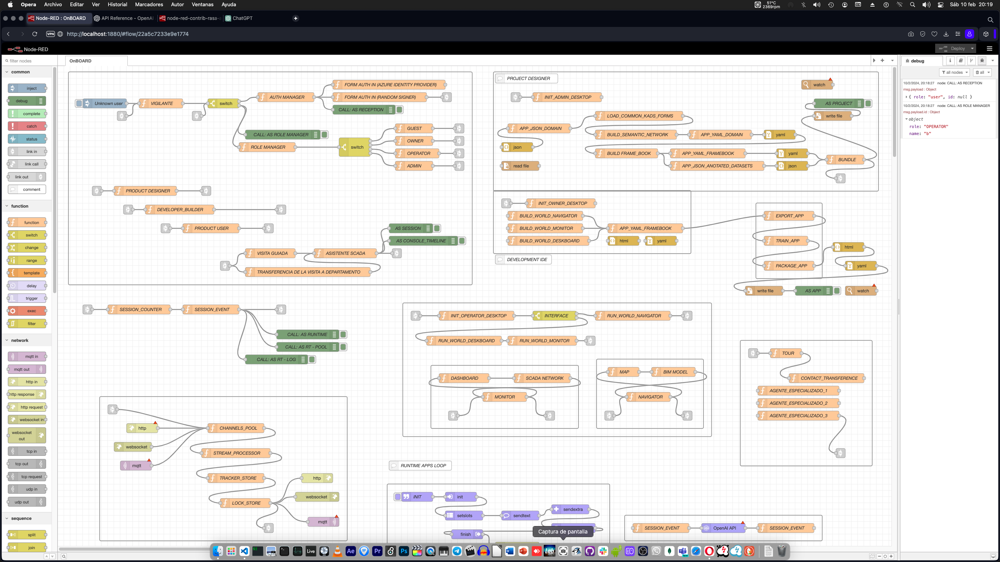
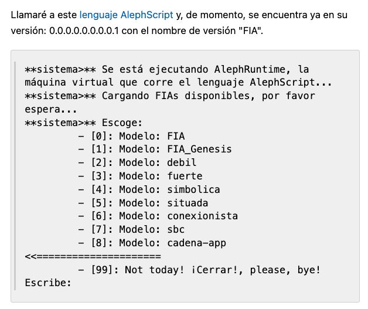
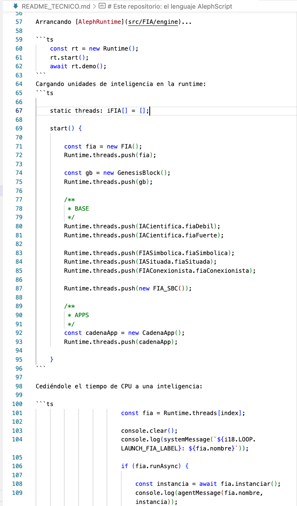

# AlephScript Bundle

## AS Seed

It is a **npm-package-library** for npm-apps over NodeJs. It allows to create "seeds" for AlephScript Apps.

An App is exportable like a bundle with CommonKADS forms, using JSON format.

This library provides tools to parse or cast entity-relation models or non-sql collections under JSON schema.

It also allows to manage collections of anotated data to train the NLU/NLG engines.

## AS Framework

It is **HMTL5/nodejs website node** that imports CommonKADS forms and converts them into AlephScript Apps. An App is library of YAML (RASA-like) model domain files defined by a semantic-network and a protocol of frames that link together user roles (an its authorized permission access to resources or interaction) with domain object model.

AS Framework provides AS IDE to wire together application logic (node-red under the hoods) with half-non-code editors, wiring that must be translated and compiled to YAML files by AS Compiler.

## AS Runtime

It is a **Docker cluster** that allow launching of AlephScript Apps and bundling them together in a System (Rasa Opensource and OpenIA Assistant API over the hoods). Authentication will provide authorization JWT Tokens to grant access either to resources info or manipulation.

AlephScript provides a superset of Role management to link context units between breakpoints or sessions all over the cluster.

## AS SDKs

They are **npm-package-libraries** to provide drivers and bridging with expert informational systems when using AS Framework to build AlephScript Apps.

## AS SDKs BIM Interface

It is a Typescript superset kit that allows matching 3D worlds by browsing vertical or horizontal in its tree together with artificial conversational assistants. Can work linked to a BIM 3D Viewer website (will receive context state) or context independant from a Chat Room.

This SDK allows to nest in a system many AlephScript Apps to map Building information model like a DOM (domain object model) on 3D worlds. Allowing to map user roles over domain sections and to manage operations over any SCADA App present in the current location for current user.

## AS SDKs SCADA Interface

It is a Typescript superset kit that allows matching monitoring and desking of machine signaling (sensor/actuators) linking SCADA boards with artificial conversational assistants. Can work linked to a SCADA dashboard website (will receive context state) or context independant from a Chat Room.

This SDK allows to map monitoring and desking of machines to be consumed (or not, standalone) in AlephScript BIM Apps as a part of the world content.

# AlephScript Bundle

## AS Seed

## AS Framework

## AS Runtime

## AS SDKs

## AS SDKs BIM Interface

## AS SDKs SCADA Interface

