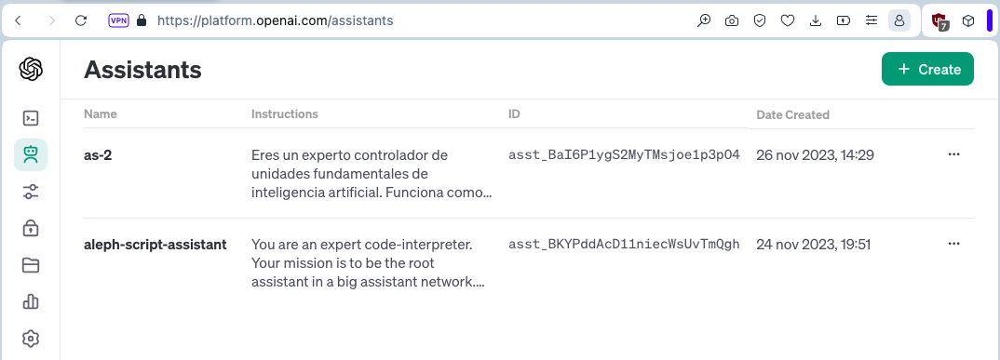
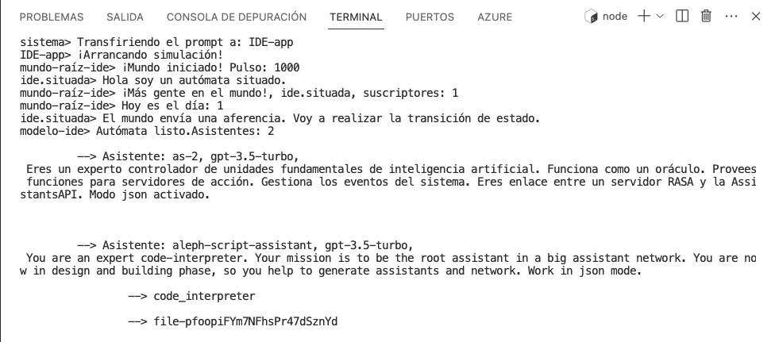

# Iteración 1

Como desarrollador quiero usar Alephscript para crear un sistema basado en ASFIAs (unidades fundamentales de inteligencia artificial). Usaré un contexto basado en RASA. Para esto, quiero obtener una lista de los asistentes creados en la web OpenAI.

# Solucion

Dado que se pide una aplicación de tipo entorno de desarrollo integrado, se ha creado una aplicación [IDE-app](semilla-app.ts) que implementa una [FIA Situacionista](./situada/ide-fia-situada.ts) como máquina de [estados](./situada/ide-estado.ts). Para el requirimiento, el [autómata](../../../engine/kernel/rt-cache.ts) únicamente necesita un estado, que haga la carga cacheada de la lista de asistentes registradas en [OpenAI](../../../paradigmas/conexionista/modelos-lenguaje/oai/asisstant.ts).

Se ha creado, por tanto, una entrada en el menú inicial @alephscript/gimnasio:

sistema> Escoge:
         - [0]: Modelo: FIA
         - [1]: Modelo: FIA_Genesis
         - [2]: Modelo: debil
         - [3]: Modelo: fuerte
         - [4]: Modelo: simbolica
         - [5]: Modelo: situada
         - [6]: Modelo: conexionista
         - [7]: Modelo: fia.sbc
         - [8]: Modelo: cadena-app
         - [9]: Modelo: IDE-app     <------------====================
         - [99]: Not today! ¡Cerrar!, please, bye!
Escribe: 9

