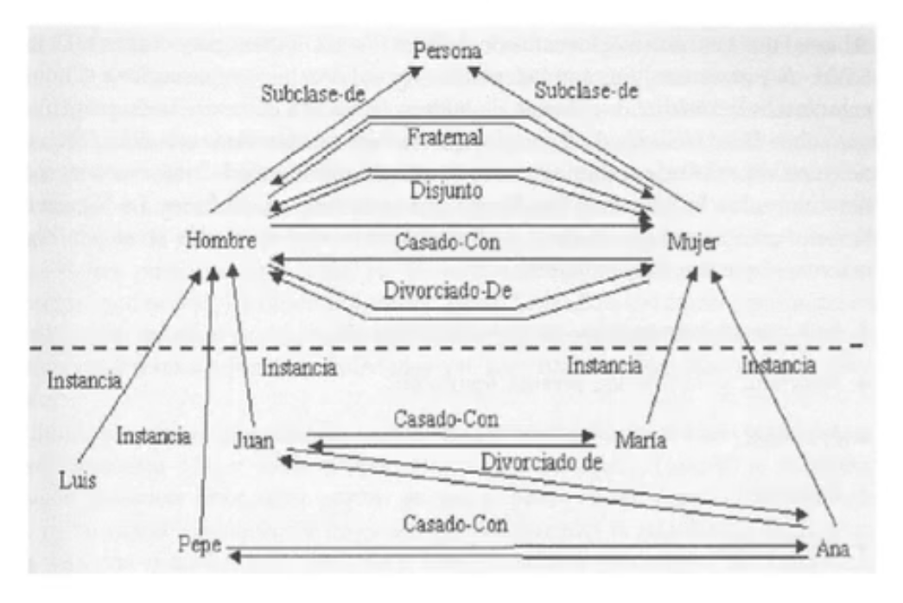

# Marcos

Evolución de las [redes semánticas](../../formal/sistema/semantica/) y ancestro de la programación orientada a objetos. Dos tipos de marcos: de [clase](./marco-clase.ts) y de [instancia](./marco-instancia.ts).

