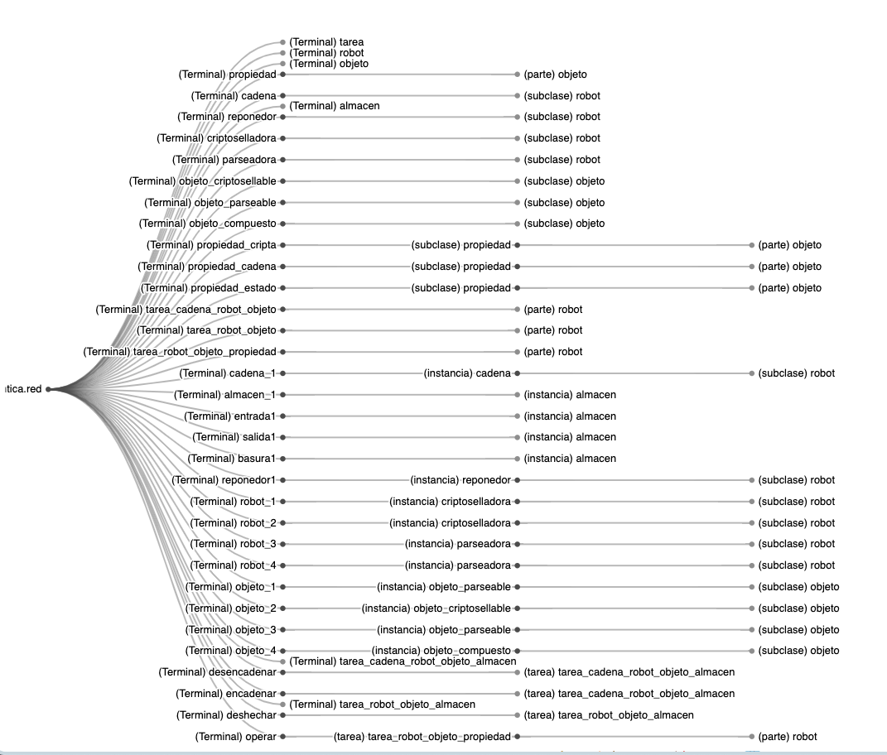
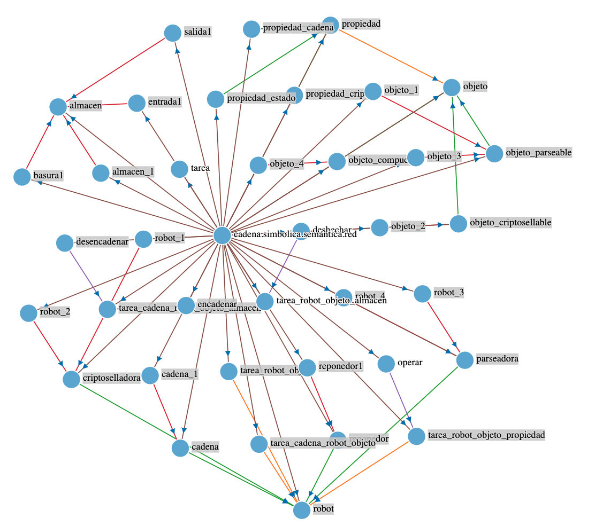

# Visualizadores de Red

En este paquete se ensayan formas de representar visualmente las redes. Se ha configurado como página web estática. Ejecutar el directorio [vistas](.) en un servidor web simple donde poder cargar distintas representaciónes de la Red Semántica. Tanto de sus entidades como de sus arcos.


Para facilitar la integración con el visualizador, se establece un [generador](../exportador-red.ts) de [archivos en disco](./d3/files/) en distinto formatos. 

## Visualizador D3JS

Estas visualizaciones parten de un formato concreto de archivo. Según la naturaleza de la visualización. Por ejemplo:

- [árbol](./d3/files/arbol.json)
- [fuerzas](./d3/files/red.json)

La [plantilla inicial HMTL del navegador](./d3/index.html) configura la carga de scripts.

El proceso de visualización consta de dos etapas:

- [Carga de los datos](./d3/index.js)
- Renderizado del grafo: por ejemplo
    - [Árbol](./d3/tree.js)
    - [Fuerzas](./d3/force-graph.js)

### Visualizacion árbol

Utiliza un tipo de datos origin que representa el árbol, por ejemplo:

```json
{
    "name": "(Terminal) propiedad_cadena",
    "children": [
        {
            "name": "(subclase) propiedad",
            "children": [
                {
                    "name": "(parte) objeto",
                    "children": []
                }
            ]
        }
    ]
}
```



### Visualizacion Fuerzas

Utiliza un tipo de datos origin que vincula los nodos de la red a través de las etiquetas, por ejemplo:

```json
[
    { "source": "propiedad", "target": "objeto", "type": "parte" },
    { "source": "cadena", "target": "robot", "type": "subclase" },
    { "source": "reponedor", "target": "robot", "type": "subclase" }
]
``````

