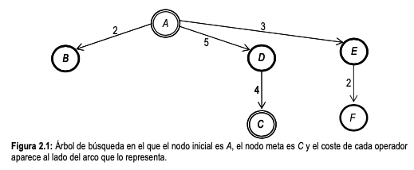

NOTA: SIN REVISAR, PUEDE CONTENER ERRORES



- (2a) Búsqueda Primero en Anchura (de izquierda a derecha)
- (2b) Búsqueda Primero en Profundidad (de derecha a izquierda)
- (2c) Búsqueda de Coste Uniforme
- (2d) Búsqueda en Anchura Iterativa (de derecha a izquierda)
- (2e) Búsqueda en Profundidad Iterativa (de izquierda a derecha)

```ts
    const b = new PrimeroEnAnchura("Primero en anchura", PrimeroEnAnchura.sucesores);
    b.test();

    const c = new PrimeroEnProfundidad();
    c.test();

    const u = new CosteUniforme("CosteUniforme", CosteUniforme.sucesores);
    u.test();

    const bI = new PrimeroEnAnchuraIterativa("Primero en anchura", PrimeroEnAnchura.sucesores);
    bI.derecha_a_izquierda = true;
    bI.test();

    const cI = new PrimeroEnProfundidadIterativa();
    cI.izquierda_a_derecha = true;
    cI.test();
```
sistema> Arrancando el sistema

# Búsqueda no informada. Primero en anchura

```
         - Abierta:  1
         - Nodo n:  A
         - Sucesor q:  B
         - Sucesor q:  D
         - Sucesor q:  E
                 - Abierta [ 'B', 'D', 'E' ]
                 - Tabla_A [
  '[ - ]->[A]: coste(inicio, n): 0 - p:  - ',
  '[A]->[B]: coste(inicio, n): 2 - p:  - ',
  '[A]->[D]: coste(inicio, n): 5 - p:  - ',
  '[A]->[E]: coste(inicio, n): 3 - p:  - '
]
         - Abierta:  3
         - Nodo n:  B
                 - Abierta [ 'D', 'E' ]
                 - Tabla_A [
  '[ - ]->[A]: coste(inicio, n): 0 - p:  - ',
  '[A]->[B]: coste(inicio, n): 2 - p:  - ',
  '[A]->[D]: coste(inicio, n): 5 - p:  - ',
  '[A]->[E]: coste(inicio, n): 3 - p:  - '
]
         - Abierta:  2
         - Nodo n:  D
         - Sucesor q:  C
                 - Abierta [ 'E', 'C' ]
                 - Tabla_A [
  '[ - ]->[A]: coste(inicio, n): 0 - p:  - ',
  '[A]->[B]: coste(inicio, n): 2 - p:  - ',
  '[A]->[D]: coste(inicio, n): 5 - p:  - ',
  '[A]->[E]: coste(inicio, n): 3 - p:  - ',
  '[D]->[C]: coste(inicio, n): 9 - p:  - '
]
         - Abierta:  2
         - Nodo n:  E
         - Sucesor q:  F
                 - Abierta [ 'C', 'F' ]
                 - Tabla_A [
  '[ - ]->[A]: coste(inicio, n): 0 - p:  - ',
  '[A]->[B]: coste(inicio, n): 2 - p:  - ',
  '[A]->[D]: coste(inicio, n): 5 - p:  - ',
  '[A]->[E]: coste(inicio, n): 3 - p:  - ',
  '[D]->[C]: coste(inicio, n): 9 - p:  - ',
  '[E]->[F]: coste(inicio, n): 5 - p:  - '
]
         - Abierta:  2
         - Nodo n:  C
         - esObjetivo:  C
         - Camino desde/a:  A C
                 - ruta:  D
                 - ruta:  A
 >>  C 3 9
 >>  D 2 5
 >>  A 1 0
Test:  true
```


# Búsqueda no informada. Primero en profunidad. Max Prof: 10

```
         - Abierta:  1
         - Nodo n:  A
         - Sucesor q:  B
         - Sucesor q:  D
         - Sucesor q:  E
                 - Abierta [ 'B', 'D', 'E' ]
                 - Tabla_A [
  '[ - ]->[A]: coste(inicio, n): 0 - p:  - ',
  '[A]->[B]: coste(inicio, n): 2 - p: 1',
  '[A]->[D]: coste(inicio, n): 5 - p: 1',
  '[A]->[E]: coste(inicio, n): 3 - p: 1'
]
         - Abierta:  3
         - Nodo n:  E
         - Sucesor q:  F
                 - Abierta [ 'B', 'D', 'F' ]
                 - Tabla_A [
  '[ - ]->[A]: coste(inicio, n): 0 - p:  - ',
  '[A]->[B]: coste(inicio, n): 2 - p: 1',
  '[A]->[D]: coste(inicio, n): 5 - p: 1',
  '[A]->[E]: coste(inicio, n): 3 - p: 1',
  '[E]->[F]: coste(inicio, n): 5 - p: 2'
]
         - Abierta:  3
         - Nodo n:  F
                 - Abierta [ 'B', 'D' ]
                 - Tabla_A [
  '[ - ]->[A]: coste(inicio, n): 0 - p:  - ',
  '[A]->[B]: coste(inicio, n): 2 - p: 1',
  '[A]->[D]: coste(inicio, n): 5 - p: 1',
  '[A]->[E]: coste(inicio, n): 3 - p: 1',
  '[E]->[F]: coste(inicio, n): 5 - p: 2'
]
         - Abierta:  2
         - Nodo n:  D
         - Sucesor q:  C
                 - Abierta [ 'B', 'C' ]
                 - Tabla_A [
  '[ - ]->[A]: coste(inicio, n): 0 - p:  - ',
  '[A]->[B]: coste(inicio, n): 2 - p: 1',
  '[A]->[D]: coste(inicio, n): 5 - p: 1',
  '[A]->[E]: coste(inicio, n): 3 - p: 1',
  '[E]->[F]: coste(inicio, n): 5 - p: 2',
  '[D]->[C]: coste(inicio, n): 9 - p: 2'
]
         - Abierta:  2
         - Nodo n:  C
         - esObjetivo:  C
         - Camino desde/a:  A C
                 - ruta:  D
                 - ruta:  A
 >>  C 3 9
 >>  D 2 5
 >>  A 1 0
Test:  true
```


# Búsqueda no informada. CosteUniforme
```
         - Abierta:  1
         - Nodo n:  A
         - Sucesor q:  B
         - Sucesor q:  E
         - Sucesor q:  D
                 - Abierta [ 'B', 'E', 'D' ]
                 - Tabla_A [
  '[ - ]->[A]: coste(inicio, n): 0 - p:  - ',
  '[A]->[B]: coste(inicio, n): 2 - p:  - ',
  '[A]->[E]: coste(inicio, n): 3 - p:  - ',
  '[A]->[D]: coste(inicio, n): 5 - p:  - '
]
         - Abierta:  3
         - Nodo n:  B
                 - Abierta [ 'E', 'D' ]
                 - Tabla_A [
  '[ - ]->[A]: coste(inicio, n): 0 - p:  - ',
  '[A]->[B]: coste(inicio, n): 2 - p:  - ',
  '[A]->[E]: coste(inicio, n): 3 - p:  - ',
  '[A]->[D]: coste(inicio, n): 5 - p:  - '
]
         - Abierta:  2
         - Nodo n:  E
         - Sucesor q:  F
                 - Abierta [ 'D', 'F' ]
                 - Tabla_A [
  '[ - ]->[A]: coste(inicio, n): 0 - p:  - ',
  '[A]->[B]: coste(inicio, n): 2 - p:  - ',
  '[A]->[E]: coste(inicio, n): 3 - p:  - ',
  '[A]->[D]: coste(inicio, n): 5 - p:  - ',
  '[E]->[F]: coste(inicio, n): 5 - p:  - '
]
         - Abierta:  2
         - Nodo n:  D
         - Sucesor q:  C
                 - Abierta [ 'F', 'C' ]
                 - Tabla_A [
  '[ - ]->[A]: coste(inicio, n): 0 - p:  - ',
  '[A]->[B]: coste(inicio, n): 2 - p:  - ',
  '[A]->[E]: coste(inicio, n): 3 - p:  - ',
  '[A]->[D]: coste(inicio, n): 5 - p:  - ',
  '[E]->[F]: coste(inicio, n): 5 - p:  - ',
  '[D]->[C]: coste(inicio, n): 9 - p:  - '
]
         - Abierta:  2
         - Nodo n:  F
                 - Abierta [ 'C' ]
                 - Tabla_A [
  '[ - ]->[A]: coste(inicio, n): 0 - p:  - ',
  '[A]->[B]: coste(inicio, n): 2 - p:  - ',
  '[A]->[E]: coste(inicio, n): 3 - p:  - ',
  '[A]->[D]: coste(inicio, n): 5 - p:  - ',
  '[E]->[F]: coste(inicio, n): 5 - p:  - ',
  '[D]->[C]: coste(inicio, n): 9 - p:  - '
]
         - Abierta:  1
         - Nodo n:  C
         - esObjetivo:  C
         - Camino desde/a:  A C
                 - ruta:  D
                 - ruta:  A
 >>  C 3 9
 >>  D 2 5
 >>  A 1 0
Test:  true
```

# Búsqueda no informada. Primero en anchura iterativa.
```
Búsqueda no informada. Primero en anchura iterativa. Anchura 0
Búsqueda no informada. Primero en anchura

         - Abierta:  1
         - Nodo n:  A
         - Sucesor q:  E
                 - Abierta [ 'E' ]
                 - Tabla_A [
  '[ - ]->[A]: coste(inicio, n): 0 - p:  - ',
  '[A]->[E]: coste(inicio, n): 3 - p:  - '
]
         - Abierta:  1
         - Nodo n:  E
         - Sucesor q:  F
                 - Abierta [ 'F' ]
                 - Tabla_A [
  '[ - ]->[A]: coste(inicio, n): 0 - p:  - ',
  '[A]->[E]: coste(inicio, n): 3 - p:  - ',
  '[E]->[F]: coste(inicio, n): 5 - p:  - '
]
         - Abierta:  1
         - Nodo n:  F
                 - Abierta []
                 - Tabla_A [
  '[ - ]->[A]: coste(inicio, n): 0 - p:  - ',
  '[A]->[E]: coste(inicio, n): 3 - p:  - ',
  '[E]->[F]: coste(inicio, n): 5 - p:  - '
]

Búsqueda no informada. Primero en anchura iterativa. Anchura 1
Búsqueda no informada. Primero en anchura
         - Abierta:  1
         - Nodo n:  A
         - Sucesor q:  B
         - Sucesor q:  D
                 - Abierta [ 'B', 'D' ]
                 - Tabla_A [
  '[ - ]->[A]: coste(inicio, n): 0 - p:  - ',
  '[A]->[E]: coste(inicio, n): 3 - p:  - ',
  '[E]->[F]: coste(inicio, n): 5 - p:  - ',
  '[A]->[B]: coste(inicio, n): 2 - p:  - ',
  '[A]->[D]: coste(inicio, n): 5 - p:  - '
]
         - Abierta:  2
         - Nodo n:  B
                 - Abierta [ 'D' ]
                 - Tabla_A [
  '[ - ]->[A]: coste(inicio, n): 0 - p:  - ',
  '[A]->[E]: coste(inicio, n): 3 - p:  - ',
  '[E]->[F]: coste(inicio, n): 5 - p:  - ',
  '[A]->[B]: coste(inicio, n): 2 - p:  - ',
  '[A]->[D]: coste(inicio, n): 5 - p:  - '
]
         - Abierta:  1
         - Nodo n:  D
         - Sucesor q:  C
                 - Abierta [ 'C' ]
                 - Tabla_A [
  '[ - ]->[A]: coste(inicio, n): 0 - p:  - ',
  '[A]->[E]: coste(inicio, n): 3 - p:  - ',
  '[E]->[F]: coste(inicio, n): 5 - p:  - ',
  '[A]->[B]: coste(inicio, n): 2 - p:  - ',
  '[A]->[D]: coste(inicio, n): 5 - p:  - ',
  '[D]->[C]: coste(inicio, n): 9 - p:  - '
]
         - Abierta:  1
         - Nodo n:  C
         - esObjetivo:  C
         - Camino desde/a:  A C
                 - ruta:  D
                 - ruta:  A
 >>  C 3 9
 >>  D 2 5
 >>  A 1 0
Test:  true
```

# Búsqueda no informada. Primero en Profundidad Iterativa
```
Búsqueda no informada. Primero en profunidad. Max Prof: 1
         - Abierta:  1
         - Nodo n:  A
                 - Abierta []
                 - Tabla_A [ '[ - ]->[A]: coste(inicio, n): 0 - p:  - ' ]
Búsqueda no informada. Primero en profunidad. Max Prof: 2
         - Abierta:  1
         - Nodo n:  A
         - Sucesor q:  E
         - Sucesor q:  D
         - Sucesor q:  B
                 - Abierta [ 'E', 'D', 'B' ]
                 - Tabla_A [
  '[ - ]->[A]: coste(inicio, n): 0 - p:  - ',
  '[A]->[E]: coste(inicio, n): 3 - p: 1',
  '[A]->[D]: coste(inicio, n): 5 - p: 1',
  '[A]->[B]: coste(inicio, n): 2 - p: 1'
]
         - Abierta:  3
         - Nodo n:  B
                 - Abierta [ 'E', 'D' ]
                 - Tabla_A [
  '[ - ]->[A]: coste(inicio, n): 0 - p:  - ',
  '[A]->[E]: coste(inicio, n): 3 - p: 1',
  '[A]->[D]: coste(inicio, n): 5 - p: 1',
  '[A]->[B]: coste(inicio, n): 2 - p: 1'
]
         - Abierta:  2
         - Nodo n:  D
                 - Abierta [ 'E' ]
                 - Tabla_A [
  '[ - ]->[A]: coste(inicio, n): 0 - p:  - ',
  '[A]->[E]: coste(inicio, n): 3 - p: 1',
  '[A]->[D]: coste(inicio, n): 5 - p: 1',
  '[A]->[B]: coste(inicio, n): 2 - p: 1'
]
         - Abierta:  1
         - Nodo n:  E
                 - Abierta []
                 - Tabla_A [
  '[ - ]->[A]: coste(inicio, n): 0 - p:  - ',
  '[A]->[E]: coste(inicio, n): 3 - p: 1',
  '[A]->[D]: coste(inicio, n): 5 - p: 1',
  '[A]->[B]: coste(inicio, n): 2 - p: 1'
]
Búsqueda no informada. Primero en profunidad. Max Prof: 3
         - Abierta:  1
         - Nodo n:  A
         - Sucesor q:  B
         - Sucesor q:  D
         - Sucesor q:  E
                 - Abierta [ 'B', 'D', 'E' ]
                 - Tabla_A [
  '[ - ]->[A]: coste(inicio, n): 0 - p:  - ',
  '[A]->[E]: coste(inicio, n): 3 - p: 1',
  '[A]->[D]: coste(inicio, n): 5 - p: 1',
  '[A]->[B]: coste(inicio, n): 2 - p: 1'
]
         - Abierta:  3
         - Nodo n:  E
         - Sucesor q:  F
                 - Abierta [ 'B', 'D', 'F' ]
                 - Tabla_A [
  '[ - ]->[A]: coste(inicio, n): 0 - p:  - ',
  '[A]->[E]: coste(inicio, n): 3 - p: 1',
  '[A]->[D]: coste(inicio, n): 5 - p: 1',
  '[A]->[B]: coste(inicio, n): 2 - p: 1',
  '[E]->[F]: coste(inicio, n): 5 - p: 2'
]
         - Abierta:  3
         - Nodo n:  F
                 - Abierta [ 'B', 'D' ]
                 - Tabla_A [
  '[ - ]->[A]: coste(inicio, n): 0 - p:  - ',
  '[A]->[E]: coste(inicio, n): 3 - p: 1',
  '[A]->[D]: coste(inicio, n): 5 - p: 1',
  '[A]->[B]: coste(inicio, n): 2 - p: 1',
  '[E]->[F]: coste(inicio, n): 5 - p: 2'
]
         - Abierta:  2
         - Nodo n:  D
         - Sucesor q:  C
                 - Abierta [ 'B', 'C' ]
                 - Tabla_A [
  '[ - ]->[A]: coste(inicio, n): 0 - p:  - ',
  '[A]->[E]: coste(inicio, n): 3 - p: 1',
  '[A]->[D]: coste(inicio, n): 5 - p: 1',
  '[A]->[B]: coste(inicio, n): 2 - p: 1',
  '[E]->[F]: coste(inicio, n): 5 - p: 2',
  '[D]->[C]: coste(inicio, n): 9 - p: 2'
]
         - Abierta:  2
         - Nodo n:  C
         - esObjetivo:  C
         - Camino desde/a:  A C
                 - ruta:  D
                 - ruta:  A
 >>  C 3 9
 >>  D 2 5
 >>  A 1 0
Test:  true
```

# Búsqueda no informada. Algoritmo General Búsqueda en Grafos AGBG

```ts
    const a = new AGBG(new GrafoAGBG());
    a.test();
```


```
Búsqueda no informada. Algoritmo General Búsqueda en Grafos AGBG
         - Abierta:  1
         - Nodo n:  N1 0
                 - Actualizando sucesores de N1: 6
         - Sucesor q:  N2
         - Sucesor q:  N3
         - Sucesor q:  N4
         - Sucesor q:  N5
         - Sucesor q:  N6
         - Sucesor q:  N7
                 - Abierta [ 'N3', 'N4', 'N2', 'N5', 'N7', 'N6' ]
                 - Tabla_A [
  '[ - ]->[N1]: coste(inicio, n): 0 - p: - ; s: 6',
  '[N1]->[N2]: coste(inicio, n): 200 - p: 1; s: 0',
  '[N1]->[N3]: coste(inicio, n): 30 - p: 1; s: 0',
  '[N1]->[N4]: coste(inicio, n): 40 - p: 1; s: 0',
  '[N1]->[N5]: coste(inicio, n): 200 - p: 1; s: 0',
  '[N1]->[N6]: coste(inicio, n): 325 - p: 1; s: 0',
  '[N1]->[N7]: coste(inicio, n): 250 - p: 1; s: 0'
]
         - Abierta:  6
         - Nodo n:  N3 1
                 - Actualizando sucesores de N3: 0
                 - Abierta [ 'N4', 'N2', 'N5', 'N7', 'N6' ]
                 - Tabla_A [
  '[ - ]->[N1]: coste(inicio, n): 0 - p: - ; s: 6',
  '[N1]->[N2]: coste(inicio, n): 200 - p: 1; s: 0',
  '[N1]->[N3]: coste(inicio, n): 30 - p: 1; s: 0',
  '[N1]->[N4]: coste(inicio, n): 40 - p: 1; s: 0',
  '[N1]->[N5]: coste(inicio, n): 200 - p: 1; s: 0',
  '[N1]->[N6]: coste(inicio, n): 325 - p: 1; s: 0',
  '[N1]->[N7]: coste(inicio, n): 250 - p: 1; s: 0'
]
         - Abierta:  5
         - Nodo n:  N4 1
                 - Actualizando sucesores de N4: 2
         - Sucesor q:  N3
                 Rectificar lista: N4, T_a:  [N1]->[N4]: coste(inicio, n): 40 - p: 1; s: 2
                         [n: N3(1)]/[p: N4(1)]Coste(inicio, p) 40 + CosteNP 35 < Coste(inicio, n) 30
                         [n: N5(1)]/[p: N4(1)]Coste(inicio, p) 40 + CosteNP 150 < Coste(inicio, n) 200
                         Nuevo valor: N5, T_a:  [N4]->[N5]: coste(inicio, n): 190 - p: 2; s: 0
         - Sucesor q:  N5
                 Rectificar lista: N4, T_a:  [N1]->[N4]: coste(inicio, n): 40 - p: 1; s: 2
                         [n: N3(1)]/[p: N4(1)]Coste(inicio, p) 40 + CosteNP 35 < Coste(inicio, n) 30
                         [n: N5(2)]/[p: N4(1)]Coste(inicio, p) 40 + CosteNP 150 < Coste(inicio, n) 190
                 - Abierta [ 'N5', 'N2', 'N7', 'N6' ]
                 - Tabla_A [
  '[ - ]->[N1]: coste(inicio, n): 0 - p: - ; s: 6',
  '[N1]->[N2]: coste(inicio, n): 200 - p: 1; s: 0',
  '[N1]->[N3]: coste(inicio, n): 30 - p: 1; s: 0',
  '[N1]->[N4]: coste(inicio, n): 40 - p: 1; s: 2',
  '[N4]->[N5]: coste(inicio, n): 190 - p: 2; s: 0',
  '[N1]->[N6]: coste(inicio, n): 325 - p: 1; s: 0',
  '[N1]->[N7]: coste(inicio, n): 250 - p: 1; s: 0'
]
         - Abierta:  4
         - Nodo n:  N5 2
                 - Actualizando sucesores de N5: 1
         - Sucesor q:  N6
                 Rectificar lista: N5, T_a:  [N4]->[N5]: coste(inicio, n): 190 - p: 2; s: 1
                         [n: N6(1)]/[p: N5(2)]Coste(inicio, p) 190 + CosteNP 100 < Coste(inicio, n) 325
                         Nuevo valor: N6, T_a:  [N5]->[N6]: coste(inicio, n): 290 - p: 3; s: 0
                 - Abierta [ 'N2', 'N7', 'N6' ]
                 - Tabla_A [
  '[ - ]->[N1]: coste(inicio, n): 0 - p: - ; s: 6',
  '[N1]->[N2]: coste(inicio, n): 200 - p: 1; s: 0',
  '[N1]->[N3]: coste(inicio, n): 30 - p: 1; s: 0',
  '[N1]->[N4]: coste(inicio, n): 40 - p: 1; s: 2',
  '[N4]->[N5]: coste(inicio, n): 190 - p: 2; s: 1',
  '[N5]->[N6]: coste(inicio, n): 290 - p: 3; s: 0',
  '[N1]->[N7]: coste(inicio, n): 250 - p: 1; s: 0'
]
         - Abierta:  3
         - Nodo n:  N2 1
                 - Actualizando sucesores de N2: 2
         - Sucesor q:  N3
                 Rectificar lista: N2, T_a:  [N1]->[N2]: coste(inicio, n): 200 - p: 1; s: 2
                         [n: N3(1)]/[p: N2(1)]Coste(inicio, p) 200 + CosteNP 25 < Coste(inicio, n) 30
                         [n: N7(1)]/[p: N2(1)]Coste(inicio, p) 200 + CosteNP 100 < Coste(inicio, n) 250
         - Sucesor q:  N7
                 Rectificar lista: N2, T_a:  [N1]->[N2]: coste(inicio, n): 200 - p: 1; s: 2
                         [n: N3(1)]/[p: N2(1)]Coste(inicio, p) 200 + CosteNP 25 < Coste(inicio, n) 30
                         [n: N7(1)]/[p: N2(1)]Coste(inicio, p) 200 + CosteNP 100 < Coste(inicio, n) 250
                 - Abierta [ 'N7', 'N6' ]
                 - Tabla_A [
  '[ - ]->[N1]: coste(inicio, n): 0 - p: - ; s: 6',
  '[N1]->[N2]: coste(inicio, n): 200 - p: 1; s: 2',
  '[N1]->[N3]: coste(inicio, n): 30 - p: 1; s: 0',
  '[N1]->[N4]: coste(inicio, n): 40 - p: 1; s: 2',
  '[N4]->[N5]: coste(inicio, n): 190 - p: 2; s: 1',
  '[N5]->[N6]: coste(inicio, n): 290 - p: 3; s: 0',
  '[N1]->[N7]: coste(inicio, n): 250 - p: 1; s: 0'
]
         - Abierta:  2
         - Nodo n:  N7 1
                 - Actualizando sucesores de N7: 1
         - Sucesor q:  N6
                 Rectificar lista: N7, T_a:  [N1]->[N7]: coste(inicio, n): 250 - p: 1; s: 1
                         [n: N6(3)]/[p: N7(1)]Coste(inicio, p) 250 + CosteNP 25 < Coste(inicio, n) 290
                         Nuevo valor: N6, T_a:  [N7]->[N6]: coste(inicio, n): 275 - p: 2; s: 0
                 - Abierta [ 'N6' ]
                 - Tabla_A [
  '[ - ]->[N1]: coste(inicio, n): 0 - p: - ; s: 6',
  '[N1]->[N2]: coste(inicio, n): 200 - p: 1; s: 2',
  '[N1]->[N3]: coste(inicio, n): 30 - p: 1; s: 0',
  '[N1]->[N4]: coste(inicio, n): 40 - p: 1; s: 2',
  '[N4]->[N5]: coste(inicio, n): 190 - p: 2; s: 1',
  '[N7]->[N6]: coste(inicio, n): 275 - p: 2; s: 0',
  '[N1]->[N7]: coste(inicio, n): 250 - p: 1; s: 1'
]
         - Abierta:  1
         - Nodo n:  N6 2
         - esObjetivo:  N6
         - Camino desde/a:  N1 N6
                 - ruta:  N7
                 - ruta:  N1
 >>  N6 2 275
 >>  N7 1 250
 >>  N1 0 0
Test:  true
```