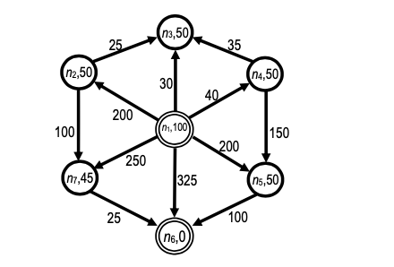

NOTA: SIN REVISAR, PUEDE CONTENER ERRORES


- (2a) Búsqueda Primero en Anchura (de izquierda a derecha)
- (2b) Búsqueda Primero en Profundidad (de derecha a izquierda)
- (2c) Búsqueda de Coste Uniforme
- (2d) Búsqueda en Anchura Iterativa (de derecha a izquierda)
- (2e) Búsqueda en Profundidad Iterativa (de izquierda a derecha)

```ts
    const b = new PrimeroEnAnchura("Primero en anchura", PrimeroEnAnchura.sucesores);
    b.test();

    const c = new PrimeroEnProfundidad();
    c.test();

    const u = new CosteUniforme("CosteUniforme", CosteUniforme.sucesores);
    u.test();

    const bI = new PrimeroEnAnchuraIterativa("Primero en anchura", PrimeroEnAnchura.sucesores);
    bI.derecha_a_izquierda = true;
    bI.test();

    const cI = new PrimeroEnProfundidadIterativa();
    cI.izquierda_a_derecha = true;
    cI.test();
```
sistema> Arrancando el sistema

# Búsqueda no informada. Primero en anchura

```
         - Abierta:  1
         - Nodo n:  A
         - Sucesor q:  B
         - Sucesor q:  D
         - Sucesor q:  E
                 - Abierta [ 'B', 'D', 'E' ]
                 - Tabla_A [
  '[ - ]->[A]: coste(inicio, n): 0 - p:  - ',
  '[A]->[B]: coste(inicio, n): 2 - p:  - ',
  '[A]->[D]: coste(inicio, n): 5 - p:  - ',
  '[A]->[E]: coste(inicio, n): 3 - p:  - '
]
         - Abierta:  3
         - Nodo n:  B
                 - Abierta [ 'D', 'E' ]
                 - Tabla_A [
  '[ - ]->[A]: coste(inicio, n): 0 - p:  - ',
  '[A]->[B]: coste(inicio, n): 2 - p:  - ',
  '[A]->[D]: coste(inicio, n): 5 - p:  - ',
  '[A]->[E]: coste(inicio, n): 3 - p:  - '
]
         - Abierta:  2
         - Nodo n:  D
         - Sucesor q:  C
                 - Abierta [ 'E', 'C' ]
                 - Tabla_A [
  '[ - ]->[A]: coste(inicio, n): 0 - p:  - ',
  '[A]->[B]: coste(inicio, n): 2 - p:  - ',
  '[A]->[D]: coste(inicio, n): 5 - p:  - ',
  '[A]->[E]: coste(inicio, n): 3 - p:  - ',
  '[D]->[C]: coste(inicio, n): 9 - p:  - '
]
         - Abierta:  2
         - Nodo n:  E
         - Sucesor q:  F
                 - Abierta [ 'C', 'F' ]
                 - Tabla_A [
  '[ - ]->[A]: coste(inicio, n): 0 - p:  - ',
  '[A]->[B]: coste(inicio, n): 2 - p:  - ',
  '[A]->[D]: coste(inicio, n): 5 - p:  - ',
  '[A]->[E]: coste(inicio, n): 3 - p:  - ',
  '[D]->[C]: coste(inicio, n): 9 - p:  - ',
  '[E]->[F]: coste(inicio, n): 5 - p:  - '
]
         - Abierta:  2
         - Nodo n:  C
         - esObjetivo:  C
         - Camino desde/a:  A C
                 - ruta:  D
                 - ruta:  A
 >>  C 3 9
 >>  D 2 5
 >>  A 1 0
Test:  true
```


# Búsqueda no informada. Primero en profunidad. Max Prof: 10

```
         - Abierta:  1
         - Nodo n:  A
         - Sucesor q:  B
         - Sucesor q:  D
         - Sucesor q:  E
                 - Abierta [ 'B', 'D', 'E' ]
                 - Tabla_A [
  '[ - ]->[A]: coste(inicio, n): 0 - p:  - ',
  '[A]->[B]: coste(inicio, n): 2 - p: 1',
  '[A]->[D]: coste(inicio, n): 5 - p: 1',
  '[A]->[E]: coste(inicio, n): 3 - p: 1'
]
         - Abierta:  3
         - Nodo n:  E
         - Sucesor q:  F
                 - Abierta [ 'B', 'D', 'F' ]
                 - Tabla_A [
  '[ - ]->[A]: coste(inicio, n): 0 - p:  - ',
  '[A]->[B]: coste(inicio, n): 2 - p: 1',
  '[A]->[D]: coste(inicio, n): 5 - p: 1',
  '[A]->[E]: coste(inicio, n): 3 - p: 1',
  '[E]->[F]: coste(inicio, n): 5 - p: 2'
]
         - Abierta:  3
         - Nodo n:  F
                 - Abierta [ 'B', 'D' ]
                 - Tabla_A [
  '[ - ]->[A]: coste(inicio, n): 0 - p:  - ',
  '[A]->[B]: coste(inicio, n): 2 - p: 1',
  '[A]->[D]: coste(inicio, n): 5 - p: 1',
  '[A]->[E]: coste(inicio, n): 3 - p: 1',
  '[E]->[F]: coste(inicio, n): 5 - p: 2'
]
         - Abierta:  2
         - Nodo n:  D
         - Sucesor q:  C
                 - Abierta [ 'B', 'C' ]
                 - Tabla_A [
  '[ - ]->[A]: coste(inicio, n): 0 - p:  - ',
  '[A]->[B]: coste(inicio, n): 2 - p: 1',
  '[A]->[D]: coste(inicio, n): 5 - p: 1',
  '[A]->[E]: coste(inicio, n): 3 - p: 1',
  '[E]->[F]: coste(inicio, n): 5 - p: 2',
  '[D]->[C]: coste(inicio, n): 9 - p: 2'
]
         - Abierta:  2
         - Nodo n:  C
         - esObjetivo:  C
         - Camino desde/a:  A C
                 - ruta:  D
                 - ruta:  A
 >>  C 3 9
 >>  D 2 5
 >>  A 1 0
Test:  true
```


# Búsqueda no informada. CosteUniforme
```
         - Abierta:  1
         - Nodo n:  A
         - Sucesor q:  B
         - Sucesor q:  E
         - Sucesor q:  D
                 - Abierta [ 'B', 'E', 'D' ]
                 - Tabla_A [
  '[ - ]->[A]: coste(inicio, n): 0 - p:  - ',
  '[A]->[B]: coste(inicio, n): 2 - p:  - ',
  '[A]->[E]: coste(inicio, n): 3 - p:  - ',
  '[A]->[D]: coste(inicio, n): 5 - p:  - '
]
         - Abierta:  3
         - Nodo n:  B
                 - Abierta [ 'E', 'D' ]
                 - Tabla_A [
  '[ - ]->[A]: coste(inicio, n): 0 - p:  - ',
  '[A]->[B]: coste(inicio, n): 2 - p:  - ',
  '[A]->[E]: coste(inicio, n): 3 - p:  - ',
  '[A]->[D]: coste(inicio, n): 5 - p:  - '
]
         - Abierta:  2
         - Nodo n:  E
         - Sucesor q:  F
                 - Abierta [ 'D', 'F' ]
                 - Tabla_A [
  '[ - ]->[A]: coste(inicio, n): 0 - p:  - ',
  '[A]->[B]: coste(inicio, n): 2 - p:  - ',
  '[A]->[E]: coste(inicio, n): 3 - p:  - ',
  '[A]->[D]: coste(inicio, n): 5 - p:  - ',
  '[E]->[F]: coste(inicio, n): 5 - p:  - '
]
         - Abierta:  2
         - Nodo n:  D
         - Sucesor q:  C
                 - Abierta [ 'F', 'C' ]
                 - Tabla_A [
  '[ - ]->[A]: coste(inicio, n): 0 - p:  - ',
  '[A]->[B]: coste(inicio, n): 2 - p:  - ',
  '[A]->[E]: coste(inicio, n): 3 - p:  - ',
  '[A]->[D]: coste(inicio, n): 5 - p:  - ',
  '[E]->[F]: coste(inicio, n): 5 - p:  - ',
  '[D]->[C]: coste(inicio, n): 9 - p:  - '
]
         - Abierta:  2
         - Nodo n:  F
                 - Abierta [ 'C' ]
                 - Tabla_A [
  '[ - ]->[A]: coste(inicio, n): 0 - p:  - ',
  '[A]->[B]: coste(inicio, n): 2 - p:  - ',
  '[A]->[E]: coste(inicio, n): 3 - p:  - ',
  '[A]->[D]: coste(inicio, n): 5 - p:  - ',
  '[E]->[F]: coste(inicio, n): 5 - p:  - ',
  '[D]->[C]: coste(inicio, n): 9 - p:  - '
]
         - Abierta:  1
         - Nodo n:  C
         - esObjetivo:  C
         - Camino desde/a:  A C
                 - ruta:  D
                 - ruta:  A
 >>  C 3 9
 >>  D 2 5
 >>  A 1 0
Test:  true
```

# Búsqueda no informada. Primero en anchura iterativa.
```
Búsqueda no informada. Primero en anchura iterativa. Anchura 0
Búsqueda no informada. Primero en anchura

         - Abierta:  1
         - Nodo n:  A
         - Sucesor q:  E
                 - Abierta [ 'E' ]
                 - Tabla_A [
  '[ - ]->[A]: coste(inicio, n): 0 - p:  - ',
  '[A]->[E]: coste(inicio, n): 3 - p:  - '
]
         - Abierta:  1
         - Nodo n:  E
         - Sucesor q:  F
                 - Abierta [ 'F' ]
                 - Tabla_A [
  '[ - ]->[A]: coste(inicio, n): 0 - p:  - ',
  '[A]->[E]: coste(inicio, n): 3 - p:  - ',
  '[E]->[F]: coste(inicio, n): 5 - p:  - '
]
         - Abierta:  1
         - Nodo n:  F
                 - Abierta []
                 - Tabla_A [
  '[ - ]->[A]: coste(inicio, n): 0 - p:  - ',
  '[A]->[E]: coste(inicio, n): 3 - p:  - ',
  '[E]->[F]: coste(inicio, n): 5 - p:  - '
]

Búsqueda no informada. Primero en anchura iterativa. Anchura 1
Búsqueda no informada. Primero en anchura
         - Abierta:  1
         - Nodo n:  A
         - Sucesor q:  B
         - Sucesor q:  D
                 - Abierta [ 'B', 'D' ]
                 - Tabla_A [
  '[ - ]->[A]: coste(inicio, n): 0 - p:  - ',
  '[A]->[E]: coste(inicio, n): 3 - p:  - ',
  '[E]->[F]: coste(inicio, n): 5 - p:  - ',
  '[A]->[B]: coste(inicio, n): 2 - p:  - ',
  '[A]->[D]: coste(inicio, n): 5 - p:  - '
]
         - Abierta:  2
         - Nodo n:  B
                 - Abierta [ 'D' ]
                 - Tabla_A [
  '[ - ]->[A]: coste(inicio, n): 0 - p:  - ',
  '[A]->[E]: coste(inicio, n): 3 - p:  - ',
  '[E]->[F]: coste(inicio, n): 5 - p:  - ',
  '[A]->[B]: coste(inicio, n): 2 - p:  - ',
  '[A]->[D]: coste(inicio, n): 5 - p:  - '
]
         - Abierta:  1
         - Nodo n:  D
         - Sucesor q:  C
                 - Abierta [ 'C' ]
                 - Tabla_A [
  '[ - ]->[A]: coste(inicio, n): 0 - p:  - ',
  '[A]->[E]: coste(inicio, n): 3 - p:  - ',
  '[E]->[F]: coste(inicio, n): 5 - p:  - ',
  '[A]->[B]: coste(inicio, n): 2 - p:  - ',
  '[A]->[D]: coste(inicio, n): 5 - p:  - ',
  '[D]->[C]: coste(inicio, n): 9 - p:  - '
]
         - Abierta:  1
         - Nodo n:  C
         - esObjetivo:  C
         - Camino desde/a:  A C
                 - ruta:  D
                 - ruta:  A
 >>  C 3 9
 >>  D 2 5
 >>  A 1 0
Test:  true
```

# Búsqueda no informada. Primero en Profundidad Iterativa
```
Búsqueda no informada. Primero en profunidad. Max Prof: 1
         - Abierta:  1
         - Nodo n:  A
                 - Abierta []
                 - Tabla_A [ '[ - ]->[A]: coste(inicio, n): 0 - p:  - ' ]
Búsqueda no informada. Primero en profunidad. Max Prof: 2
         - Abierta:  1
         - Nodo n:  A
         - Sucesor q:  E
         - Sucesor q:  D
         - Sucesor q:  B
                 - Abierta [ 'E', 'D', 'B' ]
                 - Tabla_A [
  '[ - ]->[A]: coste(inicio, n): 0 - p:  - ',
  '[A]->[E]: coste(inicio, n): 3 - p: 1',
  '[A]->[D]: coste(inicio, n): 5 - p: 1',
  '[A]->[B]: coste(inicio, n): 2 - p: 1'
]
         - Abierta:  3
         - Nodo n:  B
                 - Abierta [ 'E', 'D' ]
                 - Tabla_A [
  '[ - ]->[A]: coste(inicio, n): 0 - p:  - ',
  '[A]->[E]: coste(inicio, n): 3 - p: 1',
  '[A]->[D]: coste(inicio, n): 5 - p: 1',
  '[A]->[B]: coste(inicio, n): 2 - p: 1'
]
         - Abierta:  2
         - Nodo n:  D
                 - Abierta [ 'E' ]
                 - Tabla_A [
  '[ - ]->[A]: coste(inicio, n): 0 - p:  - ',
  '[A]->[E]: coste(inicio, n): 3 - p: 1',
  '[A]->[D]: coste(inicio, n): 5 - p: 1',
  '[A]->[B]: coste(inicio, n): 2 - p: 1'
]
         - Abierta:  1
         - Nodo n:  E
                 - Abierta []
                 - Tabla_A [
  '[ - ]->[A]: coste(inicio, n): 0 - p:  - ',
  '[A]->[E]: coste(inicio, n): 3 - p: 1',
  '[A]->[D]: coste(inicio, n): 5 - p: 1',
  '[A]->[B]: coste(inicio, n): 2 - p: 1'
]
Búsqueda no informada. Primero en profunidad. Max Prof: 3
         - Abierta:  1
         - Nodo n:  A
         - Sucesor q:  B
         - Sucesor q:  D
         - Sucesor q:  E
                 - Abierta [ 'B', 'D', 'E' ]
                 - Tabla_A [
  '[ - ]->[A]: coste(inicio, n): 0 - p:  - ',
  '[A]->[E]: coste(inicio, n): 3 - p: 1',
  '[A]->[D]: coste(inicio, n): 5 - p: 1',
  '[A]->[B]: coste(inicio, n): 2 - p: 1'
]
         - Abierta:  3
         - Nodo n:  E
         - Sucesor q:  F
                 - Abierta [ 'B', 'D', 'F' ]
                 - Tabla_A [
  '[ - ]->[A]: coste(inicio, n): 0 - p:  - ',
  '[A]->[E]: coste(inicio, n): 3 - p: 1',
  '[A]->[D]: coste(inicio, n): 5 - p: 1',
  '[A]->[B]: coste(inicio, n): 2 - p: 1',
  '[E]->[F]: coste(inicio, n): 5 - p: 2'
]
         - Abierta:  3
         - Nodo n:  F
                 - Abierta [ 'B', 'D' ]
                 - Tabla_A [
  '[ - ]->[A]: coste(inicio, n): 0 - p:  - ',
  '[A]->[E]: coste(inicio, n): 3 - p: 1',
  '[A]->[D]: coste(inicio, n): 5 - p: 1',
  '[A]->[B]: coste(inicio, n): 2 - p: 1',
  '[E]->[F]: coste(inicio, n): 5 - p: 2'
]
         - Abierta:  2
         - Nodo n:  D
         - Sucesor q:  C
                 - Abierta [ 'B', 'C' ]
                 - Tabla_A [
  '[ - ]->[A]: coste(inicio, n): 0 - p:  - ',
  '[A]->[E]: coste(inicio, n): 3 - p: 1',
  '[A]->[D]: coste(inicio, n): 5 - p: 1',
  '[A]->[B]: coste(inicio, n): 2 - p: 1',
  '[E]->[F]: coste(inicio, n): 5 - p: 2',
  '[D]->[C]: coste(inicio, n): 9 - p: 2'
]
         - Abierta:  2
         - Nodo n:  C
         - esObjetivo:  C
         - Camino desde/a:  A C
                 - ruta:  D
                 - ruta:  A
 >>  C 3 9
 >>  D 2 5
 >>  A 1 0
Test:  true
```

# Búsqueda no informada. Algoritmo General Búsqueda en Grafos AGBG

```ts
    const a = new AGBG(new GrafoAGBG());
    a.test();
```



```
         - Abierta:  1
         - Nodo n:  N1 0
                 - Actualizando sucesores de N1: 6
         - Sucesor q:  N2
         - Sucesor q:  N3
         - Sucesor q:  N4
         - Sucesor q:  N5
         - Sucesor q:  N6
         - Sucesor q:  N7
                 - Abierta [ 'N2', 'N3', 'N4', 'N5', 'N6', 'N7' ]
                 - Tabla_A [
  '[ - ]->[N1]: coste(inicio, n): 0 - p: - ; s: 6',
  '[N1]->[N2]: coste(inicio, n): 200 - p: 1; s: 0',
  '[N1]->[N3]: coste(inicio, n): 30 - p: 1; s: 0',
  '[N1]->[N4]: coste(inicio, n): 40 - p: 1; s: 0',
  '[N1]->[N5]: coste(inicio, n): 200 - p: 1; s: 0',
  '[N1]->[N6]: coste(inicio, n): 325 - p: 1; s: 0',
  '[N1]->[N7]: coste(inicio, n): 250 - p: 1; s: 0'
]
         - Abierta:  6
         - Nodo n:  N2 1
                 - Actualizando sucesores de N2: 2
         - Sucesor q:  N3
                 Rectificar lista: N2, T_a:  [N1]->[N2]: coste(inicio, n): 200 - p: 1; s: 2
                         [n: N3(1)]/[p: N2(1)]Coste(inicio, p) 200 + CosteNP 25 < Coste(inicio, n) 30
                         [n: N7(1)]/[p: N2(1)]Coste(inicio, p) 200 + CosteNP 100 < Coste(inicio, n) 250
         - Sucesor q:  N7
                 Rectificar lista: N2, T_a:  [N1]->[N2]: coste(inicio, n): 200 - p: 1; s: 2
                         [n: N3(1)]/[p: N2(1)]Coste(inicio, p) 200 + CosteNP 25 < Coste(inicio, n) 30
                         [n: N7(1)]/[p: N2(1)]Coste(inicio, p) 200 + CosteNP 100 < Coste(inicio, n) 250
                 - Abierta [ 'N3', 'N4', 'N5', 'N6', 'N7' ]
                 - Tabla_A [
  '[ - ]->[N1]: coste(inicio, n): 0 - p: - ; s: 6',
  '[N1]->[N2]: coste(inicio, n): 200 - p: 1; s: 2',
  '[N1]->[N3]: coste(inicio, n): 30 - p: 1; s: 0',
  '[N1]->[N4]: coste(inicio, n): 40 - p: 1; s: 0',
  '[N1]->[N5]: coste(inicio, n): 200 - p: 1; s: 0',
  '[N1]->[N6]: coste(inicio, n): 325 - p: 1; s: 0',
  '[N1]->[N7]: coste(inicio, n): 250 - p: 1; s: 0'
]
         - Abierta:  5
         - Nodo n:  N3 1
                 - Actualizando sucesores de N3: 0
                 - Abierta [ 'N4', 'N5', 'N6', 'N7' ]
                 - Tabla_A [
  '[ - ]->[N1]: coste(inicio, n): 0 - p: - ; s: 6',
  '[N1]->[N2]: coste(inicio, n): 200 - p: 1; s: 2',
  '[N1]->[N3]: coste(inicio, n): 30 - p: 1; s: 0',
  '[N1]->[N4]: coste(inicio, n): 40 - p: 1; s: 0',
  '[N1]->[N5]: coste(inicio, n): 200 - p: 1; s: 0',
  '[N1]->[N6]: coste(inicio, n): 325 - p: 1; s: 0',
  '[N1]->[N7]: coste(inicio, n): 250 - p: 1; s: 0'
]
         - Abierta:  4
         - Nodo n:  N4 1
                 - Actualizando sucesores de N4: 2
         - Sucesor q:  N3
                 Rectificar lista: N4, T_a:  [N1]->[N4]: coste(inicio, n): 40 - p: 1; s: 2
                         [n: N3(1)]/[p: N4(1)]Coste(inicio, p) 40 + CosteNP 35 < Coste(inicio, n) 30
                         [n: N5(1)]/[p: N4(1)]Coste(inicio, p) 40 + CosteNP 150 < Coste(inicio, n) 200
                         Nuevo valor: N5, T_a:  [N4]->[N5]: coste(inicio, n): 190 - p: 2; s: 0
         - Sucesor q:  N5
                 Rectificar lista: N4, T_a:  [N1]->[N4]: coste(inicio, n): 40 - p: 1; s: 2
                         [n: N3(1)]/[p: N4(1)]Coste(inicio, p) 40 + CosteNP 35 < Coste(inicio, n) 30
                         [n: N5(2)]/[p: N4(1)]Coste(inicio, p) 40 + CosteNP 150 < Coste(inicio, n) 190
                 - Abierta [ 'N5', 'N6', 'N7' ]
                 - Tabla_A [
  '[ - ]->[N1]: coste(inicio, n): 0 - p: - ; s: 6',
  '[N1]->[N2]: coste(inicio, n): 200 - p: 1; s: 2',
  '[N1]->[N3]: coste(inicio, n): 30 - p: 1; s: 0',
  '[N1]->[N4]: coste(inicio, n): 40 - p: 1; s: 2',
  '[N4]->[N5]: coste(inicio, n): 190 - p: 2; s: 0',
  '[N1]->[N6]: coste(inicio, n): 325 - p: 1; s: 0',
  '[N1]->[N7]: coste(inicio, n): 250 - p: 1; s: 0'
]
         - Abierta:  3
         - Nodo n:  N5 2
                 - Actualizando sucesores de N5: 1
         - Sucesor q:  N6
                 Rectificar lista: N5, T_a:  [N4]->[N5]: coste(inicio, n): 190 - p: 2; s: 1
                         [n: N6(1)]/[p: N5(2)]Coste(inicio, p) 190 + CosteNP 100 < Coste(inicio, n) 325
                         Nuevo valor: N6, T_a:  [N5]->[N6]: coste(inicio, n): 290 - p: 3; s: 0
                 - Abierta [ 'N6', 'N7' ]
                 - Tabla_A [
  '[ - ]->[N1]: coste(inicio, n): 0 - p: - ; s: 6',
  '[N1]->[N2]: coste(inicio, n): 200 - p: 1; s: 2',
  '[N1]->[N3]: coste(inicio, n): 30 - p: 1; s: 0',
  '[N1]->[N4]: coste(inicio, n): 40 - p: 1; s: 2',
  '[N4]->[N5]: coste(inicio, n): 190 - p: 2; s: 1',
  '[N5]->[N6]: coste(inicio, n): 290 - p: 3; s: 0',
  '[N1]->[N7]: coste(inicio, n): 250 - p: 1; s: 0'
]
         - Abierta:  2
         - Nodo n:  N6 3
         - esObjetivo:  N6
         - Camino desde/a:  N1 N6
                 - ruta:  N5
                 - ruta:  N4
                 - ruta:  N1
 >>  N6 3 290
 >>  N5 2 190
 >>  N4 1 40
 >>  N1 0 0
Test:  true
```

# Búsqueda no informada. Primero el Mejor

```ts
    const bf = new PrimeroElMejor(new GrafoAGBG());
    bf.test();
```

```
Búsqueda no informada. Algoritmo General Búsqueda en Grafos AGBG
                 - Abierta [ 'N1(0 + 100)' ]
                 - Tabla_A [ '[ - ]->[N1]: coste(inicio, n): 0; p: - ; s: 0' ]
         - Abierta:  1
         - Nodo n:  N1 p: 0 g(n): 0 h(n): 100
                 - Actualizando sucesores de N1: 6
         - Sucesor q:  N6
         - Sucesor q:  N7
         - Sucesor q:  N2
         - Sucesor q:  N3
         - Sucesor q:  N4
         - Sucesor q:  N5
                 - Abierta [
  'N3(30 + 50)',
  'N4(40 + 50)',
  'N2(200 + 50)',
  'N5(200 + 50)',
  'N7(250 + 45)',
  'N6(325 + 0)'
]
                 - Tabla_A [
  '[ - ]->[N1]: coste(inicio, n): 0; p: - ; s: 6',
  '[N1]->[N6]: coste(inicio, n): 325; p: 1; s: 0',
  '[N1]->[N7]: coste(inicio, n): 250; p: 1; s: 0',
  '[N1]->[N2]: coste(inicio, n): 200; p: 1; s: 0',
  '[N1]->[N3]: coste(inicio, n): 30; p: 1; s: 0',
  '[N1]->[N4]: coste(inicio, n): 40; p: 1; s: 0',
  '[N1]->[N5]: coste(inicio, n): 200; p: 1; s: 0'
]
         - Abierta:  6
         - Nodo n:  N3 p: 1 g(n): 30 h(n): 50
                 - Actualizando sucesores de N3: 0
                 - Abierta [
  'N4(40 + 50)',
  'N2(200 + 50)',
  'N5(200 + 50)',
  'N7(250 + 45)',
  'N6(325 + 0)'
]
                 - Tabla_A [
  '[ - ]->[N1]: coste(inicio, n): 0; p: - ; s: 6',
  '[N1]->[N6]: coste(inicio, n): 325; p: 1; s: 0',
  '[N1]->[N7]: coste(inicio, n): 250; p: 1; s: 0',
  '[N1]->[N2]: coste(inicio, n): 200; p: 1; s: 0',
  '[N1]->[N3]: coste(inicio, n): 30; p: 1; s: 0',
  '[N1]->[N4]: coste(inicio, n): 40; p: 1; s: 0',
  '[N1]->[N5]: coste(inicio, n): 200; p: 1; s: 0'
]
         - Abierta:  5
         - Nodo n:  N4 p: 1 g(n): 40 h(n): 50
                 - Actualizando sucesores de N4: 2
         - Sucesor q:  N3
                 Rectificar lista: N4, T_a:  [N1]->[N4]: coste(inicio, n): 40; p: 1; s: 2
                         [n: N3(1)]->[p: N4(1)], g(p) 40 + CosteNP 35 < g(n) 30
                         [n: N5(1)]->[p: N4(1)], g(p) 40 + CosteNP 150 < g(n) 200
                         Nuevo valor: N5, T_a:  [N4]->[N5]: coste(inicio, n): 190; p: 2; s: 0
                 Rectificar lista: N5, T_a:  [N4]->[N5]: coste(inicio, n): 190; p: 2; s: 0
         - Sucesor q:  N5
                 Rectificar lista: N4, T_a:  [N1]->[N4]: coste(inicio, n): 40; p: 1; s: 2
                         [n: N3(1)]->[p: N4(1)], g(p) 40 + CosteNP 35 < g(n) 30
                         [n: N5(2)]->[p: N4(1)], g(p) 40 + CosteNP 150 < g(n) 190
                 - Abierta [ 'N5(190 + 50)', 'N2(200 + 50)', 'N7(250 + 45)', 'N6(325 + 0)' ]
                 - Tabla_A [
  '[ - ]->[N1]: coste(inicio, n): 0; p: - ; s: 6',
  '[N1]->[N6]: coste(inicio, n): 325; p: 1; s: 0',
  '[N1]->[N7]: coste(inicio, n): 250; p: 1; s: 0',
  '[N1]->[N2]: coste(inicio, n): 200; p: 1; s: 0',
  '[N1]->[N3]: coste(inicio, n): 30; p: 1; s: 0',
  '[N1]->[N4]: coste(inicio, n): 40; p: 1; s: 2',
  '[N4]->[N5]: coste(inicio, n): 190; p: 2; s: 0'
]
         - Abierta:  4
         - Nodo n:  N5 p: 2 g(n): 190 h(n): 50
                 - Actualizando sucesores de N5: 1
         - Sucesor q:  N6
                 Rectificar lista: N5, T_a:  [N4]->[N5]: coste(inicio, n): 190; p: 2; s: 1
                         [n: N6(1)]->[p: N5(2)], g(p) 190 + CosteNP 100 < g(n) 325
                         Nuevo valor: N6, T_a:  [N5]->[N6]: coste(inicio, n): 290; p: 3; s: 0
                 Rectificar lista: N6, T_a:  [N5]->[N6]: coste(inicio, n): 290; p: 3; s: 0
                 - Abierta [ 'N2(200 + 50)', 'N6(290 + 0)', 'N7(250 + 45)' ]
                 - Tabla_A [
  '[ - ]->[N1]: coste(inicio, n): 0; p: - ; s: 6',
  '[N5]->[N6]: coste(inicio, n): 290; p: 3; s: 0',
  '[N1]->[N7]: coste(inicio, n): 250; p: 1; s: 0',
  '[N1]->[N2]: coste(inicio, n): 200; p: 1; s: 0',
  '[N1]->[N3]: coste(inicio, n): 30; p: 1; s: 0',
  '[N1]->[N4]: coste(inicio, n): 40; p: 1; s: 2',
  '[N4]->[N5]: coste(inicio, n): 190; p: 2; s: 1'
]
         - Abierta:  3
         - Nodo n:  N2 p: 1 g(n): 200 h(n): 50
                 - Actualizando sucesores de N2: 2
         - Sucesor q:  N3
                 Rectificar lista: N2, T_a:  [N1]->[N2]: coste(inicio, n): 200; p: 1; s: 2
                         [n: N3(1)]->[p: N2(1)], g(p) 200 + CosteNP 25 < g(n) 30
                         [n: N7(1)]->[p: N2(1)], g(p) 200 + CosteNP 100 < g(n) 250
         - Sucesor q:  N7
                 Rectificar lista: N2, T_a:  [N1]->[N2]: coste(inicio, n): 200; p: 1; s: 2
                         [n: N3(1)]->[p: N2(1)], g(p) 200 + CosteNP 25 < g(n) 30
                         [n: N7(1)]->[p: N2(1)], g(p) 200 + CosteNP 100 < g(n) 250
                 - Abierta [ 'N6(290 + 0)', 'N7(250 + 45)' ]
                 - Tabla_A [
  '[ - ]->[N1]: coste(inicio, n): 0; p: - ; s: 6',
  '[N5]->[N6]: coste(inicio, n): 290; p: 3; s: 0',
  '[N1]->[N7]: coste(inicio, n): 250; p: 1; s: 0',
  '[N1]->[N2]: coste(inicio, n): 200; p: 1; s: 2',
  '[N1]->[N3]: coste(inicio, n): 30; p: 1; s: 0',
  '[N1]->[N4]: coste(inicio, n): 40; p: 1; s: 2',
  '[N4]->[N5]: coste(inicio, n): 190; p: 2; s: 1'
]
         - Abierta:  2
         - Nodo n:  N6 p: 3 g(n): 290 h(n): 0
         - esObjetivo:  N6
         - Camino desde/a:  N1 N6
                 - ruta:  N5
                 - ruta:  N4
                 - ruta:  N1
 >>  N6 3 290
 >>  N5 2 190
 >>  N4 1 40
 >>  N1 0 0
Test:  false Coste:  290

```

# Búsqueda no informada. A*


```ts
    const ae = new AEstrella();
    ae.test();
```
Búsqueda no informada. A*

Nota: Dado que no se cumple h(n) <= h*(n) cuando n = n7, ya que h(n7) = 45 y h*(n7) = 25 el algoritmo no será admisible.

```
Búsqueda no informada. A*
                 - Abierta [ 'N1(0 + 100)' ]
                 - Tabla_A [ '[ - ]->[N1]: coste(inicio, n): 0; p: - ; s: 0' ]
         - Abierta:  1
         - Nodo n:  N1 p: 0 g(n): 0 h(n): 100
                 - Actualizando sucesores de N1: 6
         - Sucesor q:  N6
         - Sucesor q:  N7
         - Sucesor q:  N2
         - Sucesor q:  N3
         - Sucesor q:  N4
         - Sucesor q:  N5
                 - Abierta [
  'N3(30 + 50)',
  'N4(40 + 50)',
  'N2(200 + 50)',
  'N5(200 + 50)',
  'N7(250 + 45)',
  'N6(325 + 0)'
]
                 - Tabla_A [
  '[ - ]->[N1]: coste(inicio, n): 0; p: - ; s: 6',
  '[N1]->[N6]: coste(inicio, n): 325; p: 1; s: 0',
  '[N1]->[N7]: coste(inicio, n): 250; p: 1; s: 0',
  '[N1]->[N2]: coste(inicio, n): 200; p: 1; s: 0',
  '[N1]->[N3]: coste(inicio, n): 30; p: 1; s: 0',
  '[N1]->[N4]: coste(inicio, n): 40; p: 1; s: 0',
  '[N1]->[N5]: coste(inicio, n): 200; p: 1; s: 0'
]
         - Abierta:  6
         - Nodo n:  N3 p: 1 g(n): 30 h(n): 50
                 - Actualizando sucesores de N3: 0
                 - Abierta [
  'N4(40 + 50)',
  'N2(200 + 50)',
  'N5(200 + 50)',
  'N7(250 + 45)',
  'N6(325 + 0)'
]
                 - Tabla_A [
  '[ - ]->[N1]: coste(inicio, n): 0; p: - ; s: 6',
  '[N1]->[N6]: coste(inicio, n): 325; p: 1; s: 0',
  '[N1]->[N7]: coste(inicio, n): 250; p: 1; s: 0',
  '[N1]->[N2]: coste(inicio, n): 200; p: 1; s: 0',
  '[N1]->[N3]: coste(inicio, n): 30; p: 1; s: 0',
  '[N1]->[N4]: coste(inicio, n): 40; p: 1; s: 0',
  '[N1]->[N5]: coste(inicio, n): 200; p: 1; s: 0'
]
         - Abierta:  5
         - Nodo n:  N4 p: 1 g(n): 40 h(n): 50
                 - Actualizando sucesores de N4: 2
         - Sucesor q:  N3
                 Rectificar lista: N4, T_a:  [N1]->[N4]: coste(inicio, n): 40; p: 1; s: 2
                         [n: N3(1)]->[p: N4(1)], g(p) 40 + CosteNP 35 < g(n) 30
                         [n: N5(1)]->[p: N4(1)], g(p) 40 + CosteNP 150 < g(n) 200
                         Nuevo valor: N5, T_a:  [N4]->[N5]: coste(inicio, n): 190; p: 2; s: 0
                 Rectificar lista: N5, T_a:  [N4]->[N5]: coste(inicio, n): 190; p: 2; s: 0
         - Sucesor q:  N5
                 Rectificar lista: N4, T_a:  [N1]->[N4]: coste(inicio, n): 40; p: 1; s: 2
                         [n: N3(1)]->[p: N4(1)], g(p) 40 + CosteNP 35 < g(n) 30
                         [n: N5(2)]->[p: N4(1)], g(p) 40 + CosteNP 150 < g(n) 190
                 - Abierta [ 'N5(190 + 50)', 'N2(200 + 50)', 'N7(250 + 45)', 'N6(325 + 0)' ]
                 - Tabla_A [
  '[ - ]->[N1]: coste(inicio, n): 0; p: - ; s: 6',
  '[N1]->[N6]: coste(inicio, n): 325; p: 1; s: 0',
  '[N1]->[N7]: coste(inicio, n): 250; p: 1; s: 0',
  '[N1]->[N2]: coste(inicio, n): 200; p: 1; s: 0',
  '[N1]->[N3]: coste(inicio, n): 30; p: 1; s: 0',
  '[N1]->[N4]: coste(inicio, n): 40; p: 1; s: 2',
  '[N4]->[N5]: coste(inicio, n): 190; p: 2; s: 0'
]
         - Abierta:  4
         - Nodo n:  N5 p: 2 g(n): 190 h(n): 50
                 - Actualizando sucesores de N5: 1
         - Sucesor q:  N6
                 Rectificar lista: N5, T_a:  [N4]->[N5]: coste(inicio, n): 190; p: 2; s: 1
                         [n: N6(1)]->[p: N5(2)], g(p) 190 + CosteNP 100 < g(n) 325
                         Nuevo valor: N6, T_a:  [N5]->[N6]: coste(inicio, n): 290; p: 3; s: 0
                 Rectificar lista: N6, T_a:  [N5]->[N6]: coste(inicio, n): 290; p: 3; s: 0
                 - Abierta [ 'N2(200 + 50)', 'N6(290 + 0)', 'N7(250 + 45)' ]
                 - Tabla_A [
  '[ - ]->[N1]: coste(inicio, n): 0; p: - ; s: 6',
  '[N5]->[N6]: coste(inicio, n): 290; p: 3; s: 0',
  '[N1]->[N7]: coste(inicio, n): 250; p: 1; s: 0',
  '[N1]->[N2]: coste(inicio, n): 200; p: 1; s: 0',
  '[N1]->[N3]: coste(inicio, n): 30; p: 1; s: 0',
  '[N1]->[N4]: coste(inicio, n): 40; p: 1; s: 2',
  '[N4]->[N5]: coste(inicio, n): 190; p: 2; s: 1'
]
         - Abierta:  3
         - Nodo n:  N2 p: 1 g(n): 200 h(n): 50
                 - Actualizando sucesores de N2: 2
         - Sucesor q:  N3
                 Rectificar lista: N2, T_a:  [N1]->[N2]: coste(inicio, n): 200; p: 1; s: 2
                         [n: N3(1)]->[p: N2(1)], g(p) 200 + CosteNP 25 < g(n) 30
                         [n: N7(1)]->[p: N2(1)], g(p) 200 + CosteNP 100 < g(n) 250
         - Sucesor q:  N7
                 Rectificar lista: N2, T_a:  [N1]->[N2]: coste(inicio, n): 200; p: 1; s: 2
                         [n: N3(1)]->[p: N2(1)], g(p) 200 + CosteNP 25 < g(n) 30
                         [n: N7(1)]->[p: N2(1)], g(p) 200 + CosteNP 100 < g(n) 250
                 - Abierta [ 'N6(290 + 0)', 'N7(250 + 45)' ]
                 - Tabla_A [
  '[ - ]->[N1]: coste(inicio, n): 0; p: - ; s: 6',
  '[N5]->[N6]: coste(inicio, n): 290; p: 3; s: 0',
  '[N1]->[N7]: coste(inicio, n): 250; p: 1; s: 0',
  '[N1]->[N2]: coste(inicio, n): 200; p: 1; s: 2',
  '[N1]->[N3]: coste(inicio, n): 30; p: 1; s: 0',
  '[N1]->[N4]: coste(inicio, n): 40; p: 1; s: 2',
  '[N4]->[N5]: coste(inicio, n): 190; p: 2; s: 1'
]
         - Abierta:  2
         - Nodo n:  N6 p: 3 g(n): 290 h(n): 0
         - esObjetivo:  N6
         - Camino desde/a:  N1 N6
                 - ruta:  N5
                 - ruta:  N4
                 - ruta:  N1
 >>  N6 3 290
 >>  N5 2 190
 >>  N4 1 40
 >>  N1 0 0
Test:  true Coste:  290
```


```ts
    const ae = new AEstrella();
    ae.test2();
```

```
                 - Abierta [ 'A(0 + 28)' ]
                 - Tabla_A [ '[ - ]->[A]: coste(inicio, n): 0; p: - ; s: 0' ]
         - Abierta:  1
         - Nodo n:  A p: 0 g(n): 0 h(n): 28
                 - Actualizando sucesores de A: 3
         - Sucesor q:  B
         - Sucesor q:  C
         - Sucesor q:  K
                 - Abierta [ 'C(5 + 2)', 'B(10 + 1)', 'K(1 + 100)' ]
                 - Tabla_A [
  '[ - ]->[A]: coste(inicio, n): 0; p: - ; s: 3',
  '[A]->[B]: coste(inicio, n): 10; p: 1; s: 0',
  '[A]->[C]: coste(inicio, n): 5; p: 1; s: 0',
  '[A]->[K]: coste(inicio, n): 1; p: 1; s: 0'
]
         - Abierta:  3
         - Nodo n:  C p: 1 g(n): 5 h(n): 2
                 - Actualizando sucesores de C: 2
         - Sucesor q:  E
         - Sucesor q:  F
                 - Abierta [ 'E(7 + 1)', 'B(10 + 1)', 'F(25 + 2)', 'K(1 + 100)' ]
                 - Tabla_A [
  '[ - ]->[A]: coste(inicio, n): 0; p: - ; s: 3',
  '[A]->[B]: coste(inicio, n): 10; p: 1; s: 0',
  '[A]->[C]: coste(inicio, n): 5; p: 1; s: 2',
  '[A]->[K]: coste(inicio, n): 1; p: 1; s: 0',
  '[C]->[E]: coste(inicio, n): 7; p: 2; s: 0',
  '[C]->[F]: coste(inicio, n): 25; p: 2; s: 0'
]
         - Abierta:  4
         - Nodo n:  E p: 2 g(n): 7 h(n): 1
                 - Actualizando sucesores de E: 2
         - Sucesor q:  G
         - Sucesor q:  H
                 - Abierta [ 'B(10 + 1)', 'G(13 + 1)', 'H(14 + 1)', 'F(25 + 2)', 'K(1 + 100)' ]
                 - Tabla_A [
  '[ - ]->[A]: coste(inicio, n): 0; p: - ; s: 3',
  '[A]->[B]: coste(inicio, n): 10; p: 1; s: 0',
  '[A]->[C]: coste(inicio, n): 5; p: 1; s: 2',
  '[A]->[K]: coste(inicio, n): 1; p: 1; s: 0',
  '[C]->[E]: coste(inicio, n): 7; p: 2; s: 2',
  '[C]->[F]: coste(inicio, n): 25; p: 2; s: 0',
  '[E]->[G]: coste(inicio, n): 13; p: 3; s: 0',
  '[E]->[H]: coste(inicio, n): 14; p: 3; s: 0'
]
         - Abierta:  5
         - Nodo n:  B p: 1 g(n): 10 h(n): 1
                 - Actualizando sucesores de B: 2
         - Sucesor q:  D
         - Sucesor q:  E
                 Rectificar lista: B, T_a:  [A]->[B]: coste(inicio, n): 10; p: 1; s: 2
                         [n: D(2)]->[p: B(1)], g(p) 10 + CosteNP 18 < g(n) 28
                         [n: E(2)]->[p: B(1)], g(p) 10 + CosteNP 4 < g(n) 7
                 - Abierta [ 'G(13 + 1)', 'H(14 + 1)', 'F(25 + 2)', 'D(28 + 2)', 'K(1 + 100)' ]
                 - Tabla_A [
  '[ - ]->[A]: coste(inicio, n): 0; p: - ; s: 3',
  '[A]->[B]: coste(inicio, n): 10; p: 1; s: 2',
  '[A]->[C]: coste(inicio, n): 5; p: 1; s: 2',
  '[A]->[K]: coste(inicio, n): 1; p: 1; s: 0',
  '[C]->[E]: coste(inicio, n): 7; p: 2; s: 2',
  '[C]->[F]: coste(inicio, n): 25; p: 2; s: 0',
  '[E]->[G]: coste(inicio, n): 13; p: 3; s: 0',
  '[E]->[H]: coste(inicio, n): 14; p: 3; s: 0',
  '[B]->[D]: coste(inicio, n): 28; p: 2; s: 0'
]
         - Abierta:  5
         - Nodo n:  G p: 3 g(n): 13 h(n): 1
                 - Actualizando sucesores de G: 1
         - Sucesor q:  I
                 - Abierta [ 'H(14 + 1)', 'F(25 + 2)', 'D(28 + 2)', 'K(1 + 100)', 'I(27 + 500)' ]
                 - Tabla_A [
  '[ - ]->[A]: coste(inicio, n): 0; p: - ; s: 3',
  '[A]->[B]: coste(inicio, n): 10; p: 1; s: 2',
  '[A]->[C]: coste(inicio, n): 5; p: 1; s: 2',
  '[A]->[K]: coste(inicio, n): 1; p: 1; s: 0',
  '[C]->[E]: coste(inicio, n): 7; p: 2; s: 2',
  '[C]->[F]: coste(inicio, n): 25; p: 2; s: 0',
  '[E]->[G]: coste(inicio, n): 13; p: 3; s: 1',
  '[E]->[H]: coste(inicio, n): 14; p: 3; s: 0',
  '[B]->[D]: coste(inicio, n): 28; p: 2; s: 0',
  '[G]->[I]: coste(inicio, n): 27; p: 4; s: 0'
]
         - Abierta:  5
         - Nodo n:  H p: 3 g(n): 14 h(n): 1
                 - Actualizando sucesores de H: 1
         - Sucesor q:  I
                 Rectificar lista: H, T_a:  [E]->[H]: coste(inicio, n): 14; p: 3; s: 1
                         [n: I(4)]->[p: H(3)], g(p) 14 + CosteNP 14 < g(n) 27
                 - Abierta [ 'F(25 + 2)', 'D(28 + 2)', 'K(1 + 100)', 'I(27 + 500)' ]
                 - Tabla_A [
  '[ - ]->[A]: coste(inicio, n): 0; p: - ; s: 3',
  '[A]->[B]: coste(inicio, n): 10; p: 1; s: 2',
  '[A]->[C]: coste(inicio, n): 5; p: 1; s: 2',
  '[A]->[K]: coste(inicio, n): 1; p: 1; s: 0',
  '[C]->[E]: coste(inicio, n): 7; p: 2; s: 2',
  '[C]->[F]: coste(inicio, n): 25; p: 2; s: 0',
  '[E]->[G]: coste(inicio, n): 13; p: 3; s: 1',
  '[E]->[H]: coste(inicio, n): 14; p: 3; s: 1',
  '[B]->[D]: coste(inicio, n): 28; p: 2; s: 0',
  '[G]->[I]: coste(inicio, n): 27; p: 4; s: 0'
]
         - Abierta:  4
         - Nodo n:  F p: 2 g(n): 25 h(n): 2
                 - Actualizando sucesores de F: 1
         - Sucesor q:  H
                 Rectificar lista: F, T_a:  [C]->[F]: coste(inicio, n): 25; p: 2; s: 1
                         [n: H(3)]->[p: F(2)], g(p) 25 + CosteNP 10 < g(n) 14
                 - Abierta [ 'D(28 + 2)', 'K(1 + 100)', 'I(27 + 500)' ]
                 - Tabla_A [
  '[ - ]->[A]: coste(inicio, n): 0; p: - ; s: 3',
  '[A]->[B]: coste(inicio, n): 10; p: 1; s: 2',
  '[A]->[C]: coste(inicio, n): 5; p: 1; s: 2',
  '[A]->[K]: coste(inicio, n): 1; p: 1; s: 0',
  '[C]->[E]: coste(inicio, n): 7; p: 2; s: 2',
  '[C]->[F]: coste(inicio, n): 25; p: 2; s: 1',
  '[E]->[G]: coste(inicio, n): 13; p: 3; s: 1',
  '[E]->[H]: coste(inicio, n): 14; p: 3; s: 1',
  '[B]->[D]: coste(inicio, n): 28; p: 2; s: 0',
  '[G]->[I]: coste(inicio, n): 27; p: 4; s: 0'
]
         - Abierta:  3
         - Nodo n:  D p: 2 g(n): 28 h(n): 2
                 - Actualizando sucesores de D: 1
         - Sucesor q:  G
                 Rectificar lista: D, T_a:  [B]->[D]: coste(inicio, n): 28; p: 2; s: 1
                         [n: G(3)]->[p: D(2)], g(p) 28 + CosteNP 4 < g(n) 13
                 - Abierta [ 'K(1 + 100)', 'I(27 + 500)' ]
                 - Tabla_A [
  '[ - ]->[A]: coste(inicio, n): 0; p: - ; s: 3',
  '[A]->[B]: coste(inicio, n): 10; p: 1; s: 2',
  '[A]->[C]: coste(inicio, n): 5; p: 1; s: 2',
  '[A]->[K]: coste(inicio, n): 1; p: 1; s: 0',
  '[C]->[E]: coste(inicio, n): 7; p: 2; s: 2',
  '[C]->[F]: coste(inicio, n): 25; p: 2; s: 1',
  '[E]->[G]: coste(inicio, n): 13; p: 3; s: 1',
  '[E]->[H]: coste(inicio, n): 14; p: 3; s: 1',
  '[B]->[D]: coste(inicio, n): 28; p: 2; s: 1',
  '[G]->[I]: coste(inicio, n): 27; p: 4; s: 0'
]
         - Abierta:  2
         - Nodo n:  K p: 1 g(n): 1 h(n): 100
                 - Actualizando sucesores de K: 3
         - Sucesor q:  C
                 Rectificar lista: K, T_a:  [A]->[K]: coste(inicio, n): 1; p: 1; s: 3
                         [n: C(1)]->[p: K(1)], g(p) 1 + CosteNP 5 < g(n) 5
                         [n: F(2)]->[p: K(1)], g(p) 1 + CosteNP 1 < g(n) 25
                         Nuevo valor: F, T_a:  [K]->[F]: coste(inicio, n): 2; p: 2; s: 1
                 Rectificar lista: F, T_a:  [K]->[F]: coste(inicio, n): 2; p: 2; s: 1
                         [n: H(3)]->[p: F(2)], g(p) 2 + CosteNP 10 < g(n) 14
                         Nuevo valor: H, T_a:  [F]->[H]: coste(inicio, n): 12; p: 3; s: 1
                 Rectificar lista: H, T_a:  [F]->[H]: coste(inicio, n): 12; p: 3; s: 1
                         [n: I(4)]->[p: H(3)], g(p) 12 + CosteNP 14 < g(n) 27
                         Nuevo valor: I, T_a:  [H]->[I]: coste(inicio, n): 26; p: 4; s: 0
                 Rectificar lista: I, T_a:  [H]->[I]: coste(inicio, n): 26; p: 4; s: 0
                         [n: L(0)]->[p: K(1)], g(p) 1 + CosteNP 1 < g(n) 0
         - Sucesor q:  F
                 Rectificar lista: K, T_a:  [A]->[K]: coste(inicio, n): 1; p: 1; s: 3
                         [n: C(1)]->[p: K(1)], g(p) 1 + CosteNP 5 < g(n) 5
                         [n: F(2)]->[p: K(1)], g(p) 1 + CosteNP 1 < g(n) 2
                         [n: L(0)]->[p: K(1)], g(p) 1 + CosteNP 1 < g(n) 0
         - Sucesor q:  L
                 - Abierta [ 'L(2 + 100)', 'I(26 + 500)' ]
                 - Tabla_A [
  '[ - ]->[A]: coste(inicio, n): 0; p: - ; s: 3',
  '[A]->[B]: coste(inicio, n): 10; p: 1; s: 2',
  '[A]->[C]: coste(inicio, n): 5; p: 1; s: 2',
  '[A]->[K]: coste(inicio, n): 1; p: 1; s: 3',
  '[C]->[E]: coste(inicio, n): 7; p: 2; s: 2',
  '[K]->[F]: coste(inicio, n): 2; p: 2; s: 1',
  '[E]->[G]: coste(inicio, n): 13; p: 3; s: 1',
  '[F]->[H]: coste(inicio, n): 12; p: 3; s: 1',
  '[B]->[D]: coste(inicio, n): 28; p: 2; s: 1',
  '[H]->[I]: coste(inicio, n): 26; p: 4; s: 0',
  '[K]->[L]: coste(inicio, n): 2; p: 2; s: 0'
]
         - Abierta:  2
         - Nodo n:  L p: 2 g(n): 2 h(n): 100
                 - Actualizando sucesores de L: 2
         - Sucesor q:  F
                 Rectificar lista: L, T_a:  [K]->[L]: coste(inicio, n): 2; p: 2; s: 2
                         [n: F(2)]->[p: L(2)], g(p) 2 + CosteNP 1 < g(n) 2
                         [n: M(0)]->[p: L(2)], g(p) 2 + CosteNP 1 < g(n) 0
         - Sucesor q:  M
                 - Abierta [ 'M(3 + 100)', 'I(26 + 500)' ]
                 - Tabla_A [
  '[ - ]->[A]: coste(inicio, n): 0; p: - ; s: 3',
  '[A]->[B]: coste(inicio, n): 10; p: 1; s: 2',
  '[A]->[C]: coste(inicio, n): 5; p: 1; s: 2',
  '[A]->[K]: coste(inicio, n): 1; p: 1; s: 3',
  '[C]->[E]: coste(inicio, n): 7; p: 2; s: 2',
  '[K]->[F]: coste(inicio, n): 2; p: 2; s: 1',
  '[E]->[G]: coste(inicio, n): 13; p: 3; s: 1',
  '[F]->[H]: coste(inicio, n): 12; p: 3; s: 1',
  '[B]->[D]: coste(inicio, n): 28; p: 2; s: 1',
  '[H]->[I]: coste(inicio, n): 26; p: 4; s: 0',
  '[K]->[L]: coste(inicio, n): 2; p: 2; s: 2',
  '[L]->[M]: coste(inicio, n): 3; p: 3; s: 0'
]
         - Abierta:  2
         - Nodo n:  M p: 3 g(n): 3 h(n): 100
                 - Actualizando sucesores de M: 2
         - Sucesor q:  H
                 Rectificar lista: M, T_a:  [L]->[M]: coste(inicio, n): 3; p: 3; s: 2
                         [n: H(3)]->[p: M(3)], g(p) 3 + CosteNP 1 < g(n) 12
                         Nuevo valor: H, T_a:  [M]->[H]: coste(inicio, n): 4; p: 4; s: 1
                 Rectificar lista: H, T_a:  [M]->[H]: coste(inicio, n): 4; p: 4; s: 1
                         [n: I(4)]->[p: H(4)], g(p) 4 + CosteNP 14 < g(n) 26
                         Nuevo valor: I, T_a:  [H]->[I]: coste(inicio, n): 18; p: 5; s: 0
                 Rectificar lista: I, T_a:  [H]->[I]: coste(inicio, n): 18; p: 5; s: 0
                         [n: N(0)]->[p: M(3)], g(p) 3 + CosteNP 1 < g(n) 0
         - Sucesor q:  N
                 - Abierta [ 'N(4 + 100)', 'I(18 + 500)' ]
                 - Tabla_A [
  '[ - ]->[A]: coste(inicio, n): 0; p: - ; s: 3',
  '[A]->[B]: coste(inicio, n): 10; p: 1; s: 2',
  '[A]->[C]: coste(inicio, n): 5; p: 1; s: 2',
  '[A]->[K]: coste(inicio, n): 1; p: 1; s: 3',
  '[C]->[E]: coste(inicio, n): 7; p: 2; s: 2',
  '[K]->[F]: coste(inicio, n): 2; p: 2; s: 1',
  '[E]->[G]: coste(inicio, n): 13; p: 3; s: 1',
  '[M]->[H]: coste(inicio, n): 4; p: 4; s: 1',
  '[B]->[D]: coste(inicio, n): 28; p: 2; s: 1',
  '[H]->[I]: coste(inicio, n): 18; p: 5; s: 0',
  '[K]->[L]: coste(inicio, n): 2; p: 2; s: 2',
  '[L]->[M]: coste(inicio, n): 3; p: 3; s: 2',
  '[M]->[N]: coste(inicio, n): 4; p: 4; s: 0'
]
         - Abierta:  2
         - Nodo n:  N p: 4 g(n): 4 h(n): 100
                 - Actualizando sucesores de N: 1
         - Sucesor q:  I
                 Rectificar lista: N, T_a:  [M]->[N]: coste(inicio, n): 4; p: 4; s: 1
                         [n: I(5)]->[p: N(4)], g(p) 4 + CosteNP 1 < g(n) 18
                         Nuevo valor: I, T_a:  [N]->[I]: coste(inicio, n): 5; p: 5; s: 0
                 Rectificar lista: I, T_a:  [N]->[I]: coste(inicio, n): 5; p: 5; s: 0
                 - Abierta [ 'I(5 + 500)' ]
                 - Tabla_A [
  '[ - ]->[A]: coste(inicio, n): 0; p: - ; s: 3',
  '[A]->[B]: coste(inicio, n): 10; p: 1; s: 2',
  '[A]->[C]: coste(inicio, n): 5; p: 1; s: 2',
  '[A]->[K]: coste(inicio, n): 1; p: 1; s: 3',
  '[C]->[E]: coste(inicio, n): 7; p: 2; s: 2',
  '[K]->[F]: coste(inicio, n): 2; p: 2; s: 1',
  '[E]->[G]: coste(inicio, n): 13; p: 3; s: 1',
  '[M]->[H]: coste(inicio, n): 4; p: 4; s: 1',
  '[B]->[D]: coste(inicio, n): 28; p: 2; s: 1',
  '[N]->[I]: coste(inicio, n): 5; p: 5; s: 0',
  '[K]->[L]: coste(inicio, n): 2; p: 2; s: 2',
  '[L]->[M]: coste(inicio, n): 3; p: 3; s: 2',
  '[M]->[N]: coste(inicio, n): 4; p: 4; s: 1'
]
         - Abierta:  1
         - Nodo n:  I p: 5 g(n): 5 h(n): 500
                 - Actualizando sucesores de I: 1
         - Sucesor q:  J
                 - Abierta [ 'J(26 + 0)' ]
                 - Tabla_A [
  '[ - ]->[A]: coste(inicio, n): 0; p: - ; s: 3',
  '[A]->[B]: coste(inicio, n): 10; p: 1; s: 2',
  '[A]->[C]: coste(inicio, n): 5; p: 1; s: 2',
  '[A]->[K]: coste(inicio, n): 1; p: 1; s: 3',
  '[C]->[E]: coste(inicio, n): 7; p: 2; s: 2',
  '[K]->[F]: coste(inicio, n): 2; p: 2; s: 1',
  '[E]->[G]: coste(inicio, n): 13; p: 3; s: 1',
  '[M]->[H]: coste(inicio, n): 4; p: 4; s: 1',
  '[B]->[D]: coste(inicio, n): 28; p: 2; s: 1',
  '[N]->[I]: coste(inicio, n): 5; p: 5; s: 1',
  '[K]->[L]: coste(inicio, n): 2; p: 2; s: 2',
  '[L]->[M]: coste(inicio, n): 3; p: 3; s: 2',
  '[M]->[N]: coste(inicio, n): 4; p: 4; s: 1',
  '[I]->[J]: coste(inicio, n): 26; p: 6; s: 0'
]
         - Abierta:  1
         - Nodo n:  J p: 6 g(n): 26 h(n): 0
         - esObjetivo:  J
         - Camino desde/a:  A J
                 - ruta:  I
                 - ruta:  N
                 - ruta:  M
                 - ruta:  L
                 - ruta:  K
                 - ruta:  A
 >>  J 6 26
 >>  I 5 5
 >>  N 4 4
 >>  M 3 3
 >>  L 2 2
 >>  K 1 1
 >>  A 0 0
Test:  true Coste:  26
```