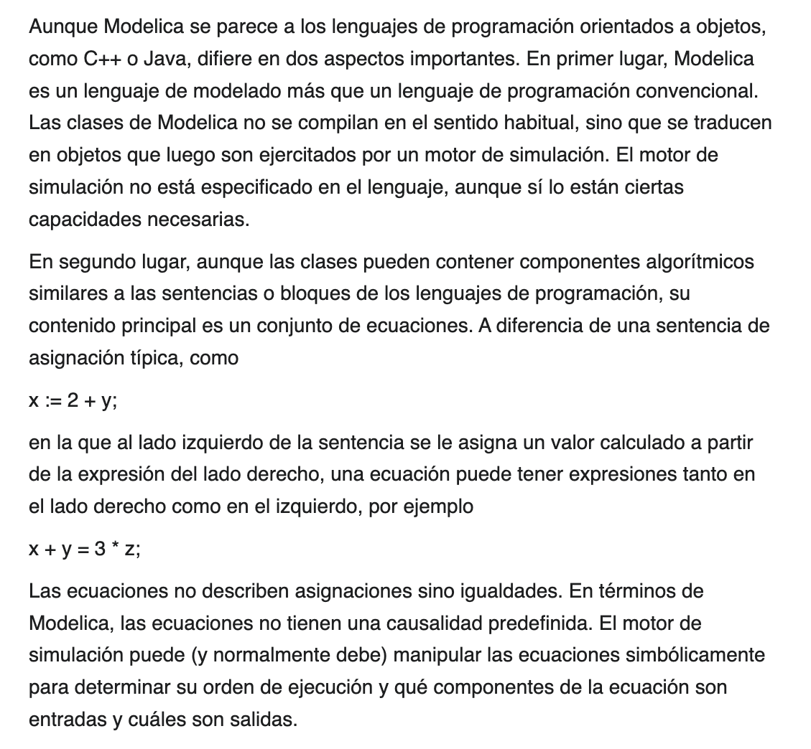

# Modelica

Modelica 1.0 se basa en la tesis doctoral de Hilding Elmqvist y en la experiencia con los lenguajes de modelado Allan, Dymola, NMF ObjectMath, Omola, SIDOPS+, y Smile. En septiembre de 1997 se publicó la versión 1.0 de la especificación de Modelica, que sirvió de base para una implementación prototipo dentro del sistema de software comercial Dymola.

Modelica es un lenguaje orientado a objetos desarrollado para describir de manera sencilla modelos de sistemas dinámicos que podrían llegar a ser muy complejos. Además de las características básicas de todo lenguaje orientado a objetos. Modelica contiene herramientas específicas que permiten describir las relaciones constitutivas de los distintos componentes de cada modelo y las relaciones estructurales que definen la interacción entre dichos componentes.

## Implementaciones o supersets a Modelica

- [Wolfram](./wolfram/)

User
¿Qué alternativas o similares a Modelica? ¿Cuál es el estado actual del estado de esa cuestión?

ChatGPT
Existen varias alternativas y lenguajes similares a Modelica, cada uno con sus propias características y enfoques específicos para la modelización y simulación de sistemas físicos. Aquí te presento algunas de las alternativas más destacadas:

Simulink (MATLAB/Simulink):

Simulink es una herramienta de modelado y simulación desarrollada por MathWorks. Al igual que Modelica, Simulink permite modelar sistemas dinámicos utilizando bloques gráficos. Se utiliza ampliamente en la industria para el diseño y la simulación de sistemas dinámicos complejos.
Dymola:

Dymola es un entorno de modelado y simulación basado en Modelica, desarrollado por Dassault Systèmes. Proporciona capacidades avanzadas para la simulación y el análisis de sistemas físicos y sistemas embebidos.
OpenModelica:

OpenModelica es un entorno de modelado y simulación de código abierto basado en Modelica. Es una herramienta de modelado general que permite a los usuarios describir sistemas físicos y sistemas embebidos utilizando el estándar Modelica.
AMESim:

AMESim (Advanced Modeling Environment for Simulation of Engineering Systems) es una herramienta de simulación desarrollada por Siemens. Se utiliza para modelar y simular sistemas físicos complejos en áreas como la hidráulica, neumática, sistemas térmicos y sistemas eléctricos.
SystemModeler (Wolfram SystemModeler):

SystemModeler es una herramienta de modelado y simulación desarrollada por Wolfram. Permite modelar sistemas físicos y sistemas de control utilizando el lenguaje Modelica y ofrece integración con otros productos de Wolfram.
Bond Graph Modeling Tools:

Los modelos de grafo de enlace (bond graph) son una forma alternativa de representar sistemas físicos. Hay herramientas específicas, como 20-sim, que se centran en la modelización basada en bond graphs para sistemas dinámicos.
En cuanto al estado actual de estas herramientas y enfoques, la modelización y simulación de sistemas físicos siguen siendo áreas de investigación y desarrollo activas. Existen esfuerzos continuos para mejorar la precisión, la eficiencia y la interoperabilidad de estas herramientas. Además, la adopción de estándares abiertos como Modelica y el enfoque de código abierto en herramientas como OpenModelica contribuyen a la evolución constante de este campo. Los usuarios suelen elegir la herramienta que mejor se adapte a sus necesidades específicas y requisitos de dominio.