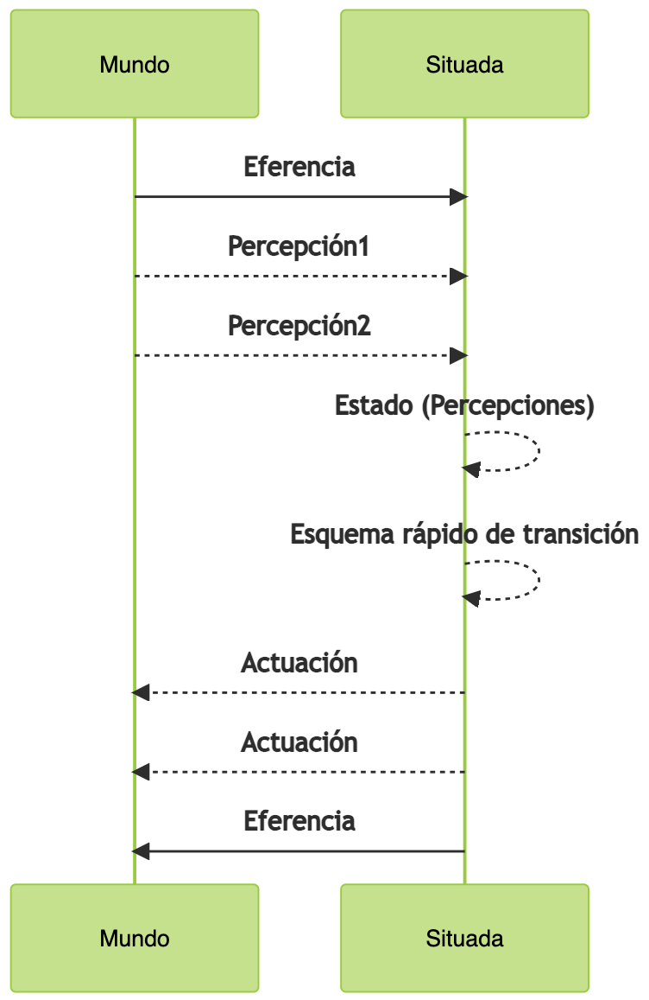
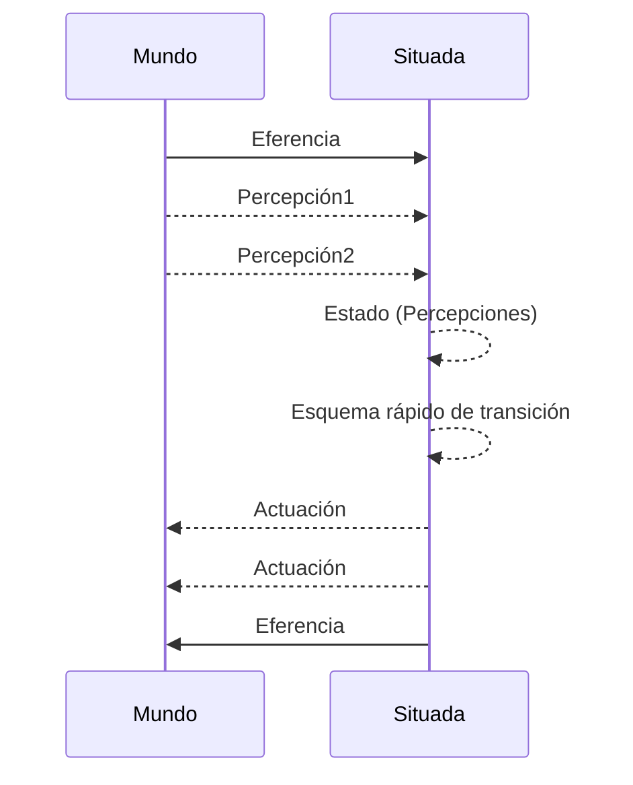
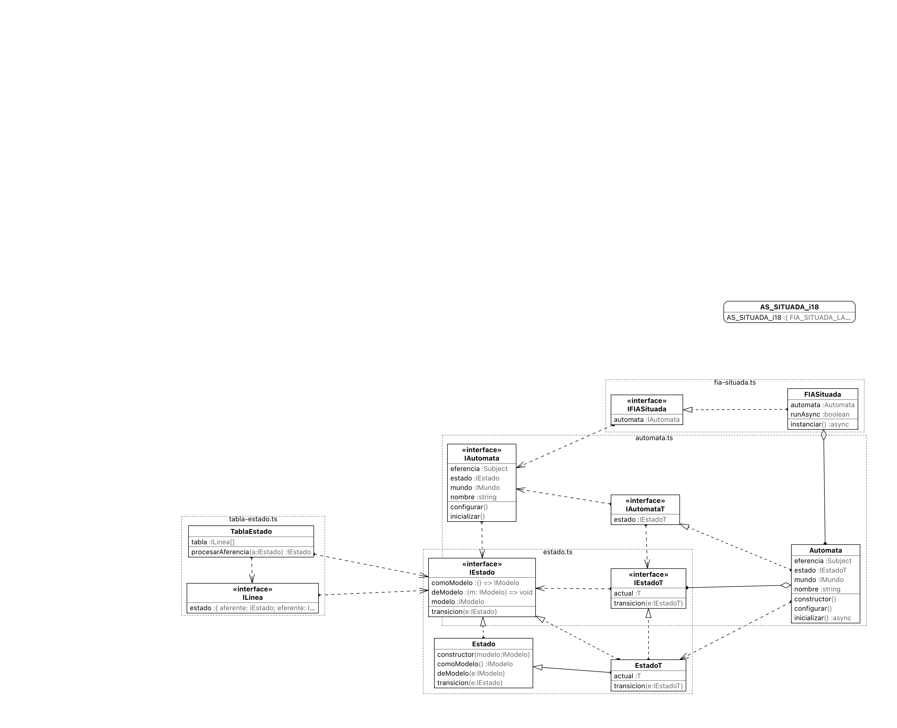

# Inteligencia Artificial Fundamental Situada.

Eminentemente reactiva. Percepción del exterior mediante sensores aferentes y uso de actuadores (motores) para eferencias. Tiempo de respuesta casi inmediato, no uso de "deliberadores" que consuman tiempo entre aferencia y eferencia, uso de esquemas codificados algorítmicamente de bajo consumo de cómputo.

Ver ejemplo de una [FIA Situada](fia-situada.ts), en aplicación práctica, modelizando [el motor de una cinta transportadora](../../aplicaciones/cadena/situada/), en una [cadena de producción](../../aplicaciones/cadena/) (objetos cargados en la cinta tratados en distintas posiciones).

La *función de decisión* del agente (la inferencia y su control) es esencialmente un esquema de asociación ([una tabla](tabla-estado.ts)) o un [autómata finito](./automata.ts) que maneja una [máquina de estados](./estado.ts) con la función de transición entre ellos.

